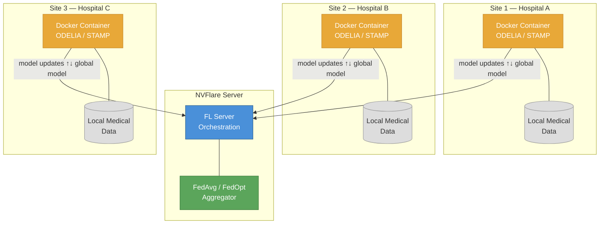
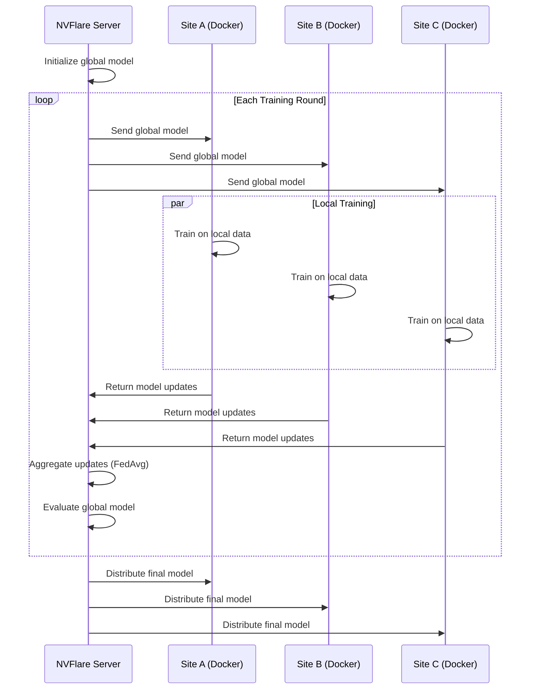

# MediSwarm

An open-source platform advancing medical AI via privacy-preserving swarm learning, based on NVFlare and developed with
the ODELIA consortium.

[](https://github.com/KatherLab/MediSwarm/actions/workflows/pr-test.yaml)
[](https://github.com/KatherLab/MediSwarm/actions/workflows/update-apt-versions.yml)

## What is MediSwarm?

MediSwarm is a federated / swarm learning framework for **medical imaging**. It
lets hospitals and research institutions collaboratively train deep-learning
models on distributed datasets without ever sharing raw patient data. Each site
trains locally inside a Docker container, and only model updates (gradients or
weights) leave the institution — coordinated by an
[NVIDIA FLARE (NVFlare) 2.7.2](https://github.com/NVIDIA/NVFlare) server.

MediSwarm currently ships two production pipelines — **ODELIA** for 3D breast
MRI classification and **STAMP** for computational pathology — and is designed
to be extended with new tasks through a simple compatibility interface
(see [Making Your Training Code MediSwarm-Compatible](docs/MEDISWARM_COMPATIBILITY_GUIDE.md)).

## Quick Start for Your Role

Choose your role and follow the instructions:

- [Swarm Participant (Medical Site / Data Scientist)](assets/readme/README.participant.md)
- [Developer (Docker, Code, Pipeline)](assets/readme/README.developer.md)
- [Swarm Operator (Provisioning, VPN, Server)](assets/readme/README.operator.md)
- [Automated Deploy & Test Workflow](DEPLOY_README.md)
- [Making Your Training Code MediSwarm-Compatible](docs/MEDISWARM_COMPATIBILITY_GUIDE.md)

## System Architecture

The diagram below shows how MediSwarm connects multiple hospital sites through
an NVFlare server. Each site runs training inside its own Docker container;
only model updates travel over the network.



## Training Pipeline

A federated training run proceeds in rounds. The server sends the current
global model to all sites, each site trains locally, and the server aggregates
the returned updates.



## Supported Pipelines

| Pipeline | Domain | Input | Backbone(s) | Docker Image | Python | PyTorch |
|----------|--------|-------|-------------|--------------|--------|---------|
| **ODELIA** | Breast MRI classification | 3D NIfTI volumes | DenseNet-121, DINOv2 | `jefftud/odelia:1.2.0` | 3.10 | 2.2.2 |
| **STAMP** | Computational pathology (classification / survival) | H5 feature files | VIT, MLP, TransMIL | `jefftud/stamp:<version>` | 3.11 | 2.7.1 |

**ODELIA** — A 3D CNN pipeline for ternary classification on breast MRI,
originating from the [ODELIA consortium](https://odelia.ai). Uses DenseNet-121
as the default backbone with optional DINOv2 feature extraction.

**STAMP** — Solid Tumor Associative Modeling in Pathology, based on
[KatherLab STAMP 2.4.0](https://github.com/KatherLab/STAMP). Operates on
pre-extracted H5 feature files (not raw whole-slide images), supporting
classification and survival prediction tasks with multiple attention-based
backbones.

## Key Features

- **Privacy by design** — raw data never leaves the hospital; only model
  weights/gradients are transmitted
- **Dockerized reproducibility** — every site runs the identical container image,
  eliminating environment drift
- **NVFlare 2.7.2** — built on NVIDIA's production-grade federated learning
  platform (local fork in `docker_config/NVFlare/`)
- **Multi-pipeline** — supports diverse imaging modalities (3D MRI, pathology
  features) from a single framework
- **Provisioning & VPN** — turnkey provisioning YAML files and OpenVPN guides
  for secure multi-site deployments
- **CI/CD** — automated PR tests, integration tests, and Docker image builds
  via GitHub Actions
- **Live sync** — `kit_live_sync/` utilities for real-time startup kit
  synchronization across sites
- **Evaluation toolkit** — scripts for benchmarking, log parsing, AUROC
  plotting, and prediction (`scripts/evaluation/`)

## Project Structure

```
MediSwarm/
├── application/
│   ├── jobs/                         # NVFlare job definitions
│   │   ├── ODELIA_ternary_classification/
│   │   ├── STAMP_classification/
│   │   ├── cifar10/                  # Reference / smoke-test job
│   │   ├── minimal_training_pytorch_cnn/
│   │   └── _shared/                  # Shared job components
│   └── provision/                    # Provisioning YAML files
│       ├── project_Odelia_allsites.yml
│       ├── project_HA.yml
│       └── ...
├── docker_config/
│   ├── Dockerfile_ODELIA             # ODELIA image (Python 3.10)
│   ├── Dockerfile_STAMP              # STAMP image  (Python 3.11)
│   ├── Dockerfile_cifar10            # Minimal test image
│   ├── NVFlare/                      # Local NVFlare 2.7.2 fork
│   └── master_template.yml
├── scripts/
│   ├── build/                        # Docker build & startup-kit scripts
│   ├── ci/                           # CI helpers (integration tests, apt updates)
│   ├── evaluation/                   # Benchmarking, log parsing, AUROC plots
│   └── client_node_setup/            # Site-level setup utilities
├── docs/                             # Extended documentation
├── tests/
│   ├── integration_tests/            # End-to-end NVFlare simulation tests
│   └── unit_tests/                   # Model & config unit tests
├── assets/                           # Role-specific READMEs, diagrams
├── server_tools/                     # Server management utilities
├── kit_live_sync/                    # Startup-kit live synchronization
├── workspace/                        # Runtime workspace (gitignored)
├── odelia_image.version              # Current version (1.2.0)
├── pyproject.toml
├── deploy_and_test.sh                # One-click deploy & test
└── README.md
```

## License

MIT — see [LICENSE](LICENSE).

## Maintainers

- [Jeff](https://github.com/Ultimate-Storm)
- [Ole Schwen](mailto:ole.schwen@mevis.fraunhofer.de)
- [Steffen Renisch](mailto:steffen.renisch@mevis.fraunhofer.de)

## Contributing

Contributions welcome! [Open an issue](https://github.com/KatherLab/MediSwarm/issues) or submit a PR.

## Credits

Built on:

- [NVFLARE](https://github.com/NVIDIA/NVFlare)
- [KatherLab STAMP](https://github.com/KatherLab/STAMP)
- [ODELIA Consortium](https://odelia.ai)
