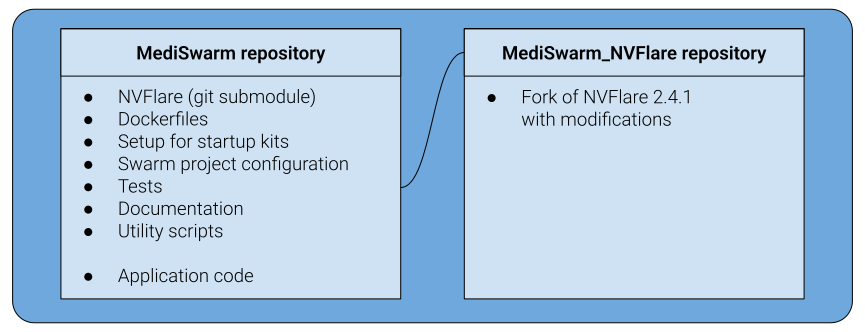
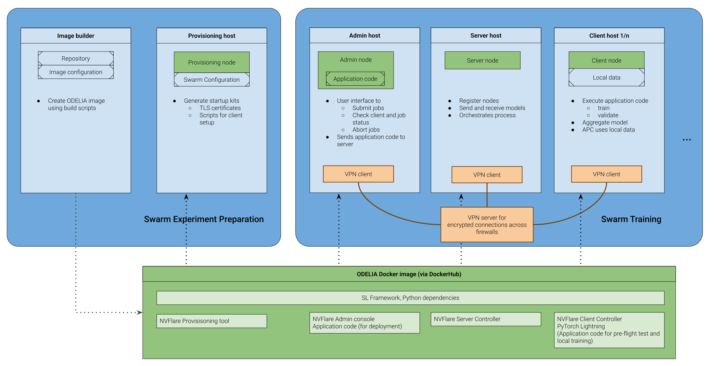
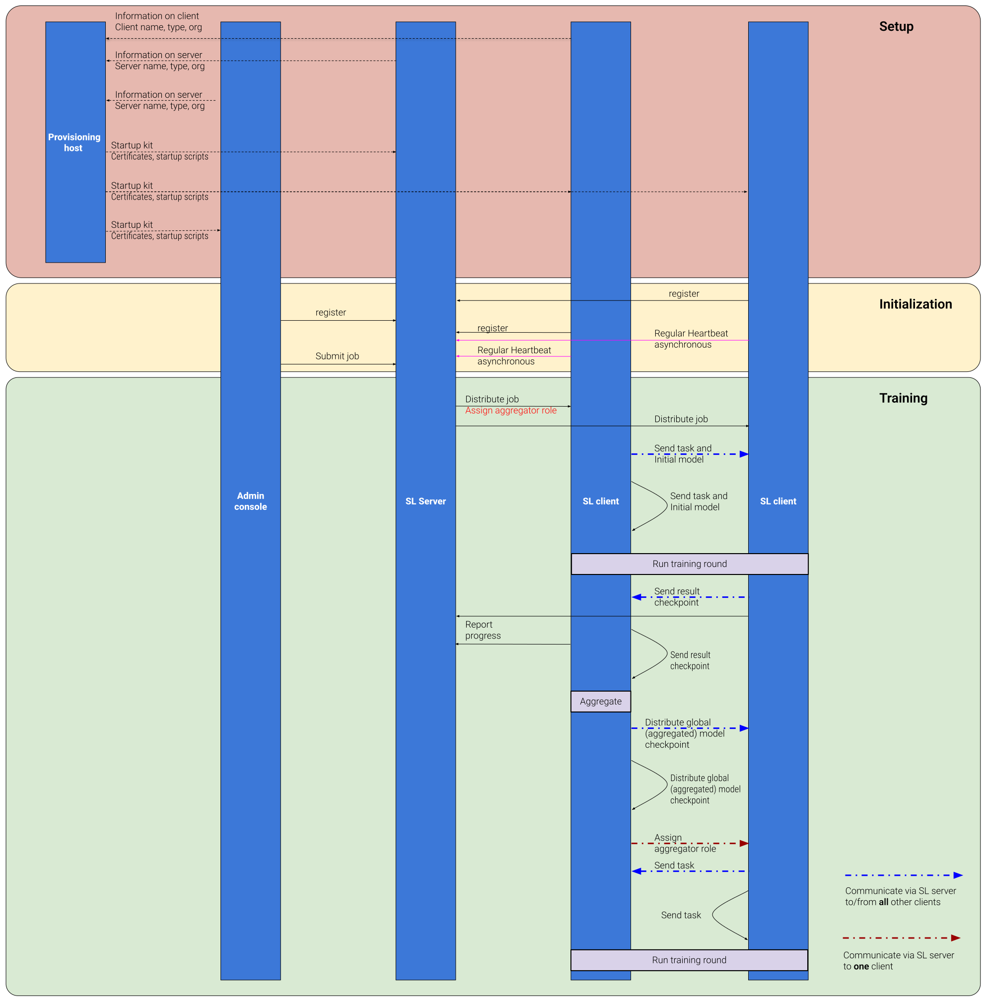

**Project ODELIA**

# MediSwarm Software Design Specification

Document-ID: MediSwarm-SPEC-SDS

### References

| Document-ID        | Title                                        |
| :----              | :----                                        |
| MediSwarm-SPEC-SRS | MediSwarm Software Requirement Specification |

## 1 Introduction and Overview

This document summarizes the software design and architecture of the MediSwarm swarm learning framework according to the Software Requirements.
The framework is used to enable distributed training of algorithms on private data (i.e. data are accessed solely by the respective hosting node, other participants have no access to the data) at participating sites according to a swarm learning approach, i.e., a joint model is trained by participating nodes in an egalitarian fashion and made available to all participating nodes without a central instance controlling the training process (Warnat-Herresthal et al.: Swarm Learning for decentralized and confidential clinical machine learning, [https://doi.org/10.1038/s41586-021-03583-3](https://doi.org/10.1038/s41586-021-03583-3)). It builds largely on NVFlare (NVIDIA Federated Learning Application Runtime Environment; [https://github.com/NVIDIA/NVFlare](https://github.com/NVIDIA/NVFlare)), an open source framework for federated learning provided by NVidia, and also reuses many of its concepts. For a documentation of NVFlare see [https://nvflare.readthedocs.io/en/main/index.html](https://nvflare.readthedocs.io/en/main/index.html). Importantly, the code performing the actual productive algorithm training (i.e., optimizing model parameters wrt. local data), henceforth called “application code” (ApC), is not considered part of the system.

### 1.1 Workflows

Running a swarm training using MediSwarm first requires an Algorithmic Researcher and Data Contributors to agree on a task to be solved and data to be used for training an algorithm to solve this task (e.g., a ternary classification of breast MRI images in no/benign/malignant lesion). Once this is agreed upon, the following workflows are started:

* Experiment setup: With actual model training code (typically using e.g. PyTorch) and a data preparation scheme developed outside of the swarm learning system, the code has to be verified to be swarm ready (e.g. using the NVFlare simulation or proof-of-concept mode), and then the respective docker image has to be built. With this docker image, the startup kits for the participating sites are generated; the distribution of those is handled outside of the system.
* Data preparation
* Local Training
* Swarm Training

### 1.2 Swarm Training Terminology

Swarm training is a specific form of federated training (a specific form of distributed training). In NVFlare, the following terminology is used:

* *Training job:* all clients jointly train a model
* *Training task:* a client receives a model and trains it for a number of epochs, providing its update for aggregation
* *Training round:* all clients perform the same training task on their private data, training for a number of epochs possibly depending on the client. Model updates are communicated and aggregated after each round.
* *Swarm server:* one node per swarm that admits admin and client nodes to the swarm and forwards communication between nodes.
* *Swarm client:* multiple clients per swarm who run training tasks on their local data. The clients negotiate one aggregator per round.
* *Aggregation:* Computing a new global model at the end of a training round from the previous global model and the model updates gathered from the client nodes.

## 2 Overview of the Framework

MediSwarm repository structure on github ([https://github.com/KatherLab/MediSwarm](https://github.com/KatherLab/MediSwarm), [https://github.com/KatherLab/NVFlare\_MediSwarm](https://github.com/KatherLab/NVFlare_MediSwarm))
The MediSwarm framework builds on the NVFlare software published by NVidia. For the MediSwarm application, NVFlare is configured for swarm learning, the execution environment is packaged into a container image and deployed on the participating nodes behind a VPN connection. To increase security, the entire messaging is encrypted; the respective certificates are generated in a separate step and distributed via a secure channel outside of the system.

### 2.1 Execution environment

#### 2.1.1 VPN

MediSwarm nodes communicate via a VPN to enable communication across institutional firewalls in a way inaccessible to non-participants of the swarm. In the ODELIA implementation, the third-party provider goodaccess is used for this purpose.
Hosts of the node connect to the VPN so that all node-to-node communication is routed through the VPN (except if multiple nodes are running on the same host).
The swarm server host has a fixed IP address in the VPN, the nodes need to be configured such that the server host name is resolved to this IP address.
The VPN setup is part of the environment, not of MediSwarm; no framework components are used.

#### 2.1.2 Network communication

The nodes communicate using http via two configurable ports, one for client ↔ server communication, one for admin ↔ server communication. The ports are configured per experiment in MediSwarm/application/provision/project\_\<NAME\>.yml. In the ODELIA implementation, ports 8002 and 8003 are used.

#### 2.1.3 Containerization

MediSwarm uses containerization for two reasons: for deployment and for having a consistent execution environment. A single container image is built once for all subsequent purposes in order to ensure a consistent NVFlare version in all steps corresponding to one swarm training, at the cost of having unnecessarily large images for the separate purposes. The application code is contained in the image so that a local training on the clients uses the same code as gets deployed for swarm training. This provides the opportunity for each partner to check the application code beforehand, and to ensure that only previously checked code is executed. Container images are named specifically for specific swarm trainings and pulled automatically by startup scripts on the swarm nodes (no user interaction needed).
To the extent applicable, folders from the respective host systems are mounted into the container: private data for swarm training (read-only), folders for logs and other output files (read+write). Communication between swarm nodes via the respective configured ports is routed from the host to the container.

### 2.2 User Management

User management in the sense of individualized accounts is only applicable to the host systems running the swarm nodes and uses the respective user management and auth mechanisms on the local systems.
Within the swarm, nodes mutually authenticate via certificates, authorization to perform certain tasks (e.g., the ability to deploy a swarm training) is configured via the type of each node.

### 2.3 Configuration

The swarm configuration involves

* Configuration of the different types of nodes
  * Client nodes
  * Server node
  * Admin node
* Host name and ports of the server (to which client and admin nodes will initiate connections)
* Name of the container image to be used
* This is configured in a project\_\<NAME\>.yml file.
* This configuration is used when creating startup kits.

The startup kits involves

* Configuration of the scripts to be provided to different types of swarm nodes
* This is configured in a master\_template.yml file.
* This configuration is used when creating startup kits.

The job to be run in the swarm involves

* Configuration of the server node fed\_server.conf
* Configuration of client nodes via fed\_client.conf
* The application code to be run (for training) as a directory containing python code
* This configuration is used when submitting a job.

The client node requires additional configuration when starting the training (server and admin nodes are configured statically via the startup kits)

* Resources on the host (data directory, scratch directory, GPU to be used) are specified as command-line arguments when starting a client node.

### 2.4 Data Management and Handling

The swarm learning framework mainly handles the following types of data:

* Status information
  * heartbeats are exchanged between nodes so that the swarm server can keep track of available clients and connections
  * memory/load status information of server and client nodes can be requested via the admin console
* Application code is sent from the admin console to the client nodes via the server, it is moreover contained in the container images
* Model updates as provided by the client nodes are sent between client nodes via the server.

In principle, the application code can send arbitrary data between nodes and to external locations. Technical mechanisms to potentially prevent such communication are not part of MediSwarm; certain restrictions could be implemented in the execution environment (e.g., firewall settings to limit communication to the swarm server).
Access to actual training / validation data is handled by the host system in conjunction with the configuration of the container; typically access to a file system is passed through from the host system to the respective client node container. Those data should not be communicated to other parts of the swarm system, however this restriction is not enforced by the MediSwarm implementation.

### 2.5 Installation and Uninstallation

For steps in the workflow requiring source code access, e.g. building a new docker image with different application code, the source code is obtained from a git repository on [github.com](http://github.com).
The participating nodes receive a startup kit containing a script that will download the required container image from a container registry (specifically the public Docker hub) and start the containers with different settings (see REFERENCE to where this is described).
Both make no changes to the host system configuration. The source code is uninstalled by deleting the local repository clone. Startup kits are uninstalled by deleting the respective directories where the archives were unpacked to. Docker images are uninstalled via Docker’s mechanism to delete images, possibly followed by docker system prune or an analogous command.

## 3 Components

Overview of hosts/components and contents of the joint ODELIA container image used on all hosts.

The overall system consists of the components shown in the image above. Note that the components are employed during different phases of a swarm. The container image builder is required to generate the container image for the specific learning task. The provisioner creates startup kits for the participating nodes during the deployment phase. Server, client and admin nodes constitute the actual swarm during the training phase. Provisioner, server, client and admin node are specifically configured and orchestrated variants of the respective base NVFlare components. The system is accompanied by a number of development scripts, and it contains application code for certain testing tasks (see section “Additional software parts”).

### 3.1 Common Aspects

#### 3.1.1 Container Image

docker\_config/Dockerfile\_ODELIA defines installation of Docker image

* We use a joint Docker image for all components to ensure version compatibility (accepting that image contains more than necessary for each component)
* We have a MediSwarm script to build the Docker image, pushing to Docker registry is an additional manual step for selected images to be distributed (do not push each development and testing image)

#### 3.1.2 Startup Kit Contents

* Startup kits contain standard X.509 CA \+ certificates for each node for mutual authentication and scripts to pull the container image and start the container with respective functionality
  * Building startup kits: see provisioning
  * Distribution happens outside system (e.g., e-mail, chat, download)
* In the startup kits, startup/docker.sh is the starting point, this script pulls the corresponding container image and starts the container with required information and entry point to start provisioning/server/clients/admin console.
* The certificates/CA contained in the startup kit and mounted into the containers so that nodes can mutually authenticate.

#### 3.1.3 Creating the Container Image and Startup Kits

Conceptually, building the container image and the startup kits are separate steps. The current implementation builds the Docker image and creates the startup kits (using the provisioning node) in one script to ensure consistency (i.e., ensure the container image used to create the startup kits is identical to the container image deployed for server, client and admin nodes). buildDockerImageAndStartupKits.sh is used

* to **build the Docker image** via docker build on the host configured by docker\_config/Dockerfile\_ODELIA, and
* **generate the startup kits** via NVFlare code (see below)
  * Starting a container with this image
  * Calling nvflare provision in the container (configuration files are contained in the image)
  * Creating one (zip) archive per node (server, clients, admin console) of the startup kits.

#### 3.1.4 Application Code Deployment

The admin console distributes the ApC for swarm training from the container image, which is thus also already available to the clients.
Rationale:

* The clients need the same version of the ApC for preflight checks and in particular for local training, else one can easily accidentally use non-comparable model trainings.
* NVFlare distributed training works by distributing the ApC. We use this mechanism rather than building a more complicated solution.
* To avoid accidentally using different ApC in the swarm, the admin console takes the ApC from within the image and thus does not need the ApC locally (as a clone of the MediSwarm repository).
* Consistency of the ApC is achieved by convention: A single commit ID (hash) identifies the version of NVFlare, MediSwarm, and the ApC. (Implementation: MediSwarm and the ApC are maintained in the same git repository, NVFlare is a submodule.) This ID is reflected in the image name. All steps use the ApC contained in the image.

#### 3.1.5 Server vs. Client

The swarm has one server and multiple clients (part of the system) running in containers. The VPN has one server (in our case hosted by an external service provider), all swarm nodes are running on hosts that also run VPN clients. In particular, the swarm server needs a VPN client running on the same host.

### 3.2 Network communication

Communication outside and within the swarm learning framework.

Server, client and admin node use the NVFlare CellNet mechanism for network communication (see [https://nvflare.readthedocs.io/en/2.4.1/user\_guide/configurations/communication\_configuration.html](https://nvflare.readthedocs.io/en/2.4.1/user_guide/configurations/communication_configuration.html)), which is specifically designed to robustly communicate individual messages as well as large chunks of binary data (e.g. model weights). CellNet can be configured to use different underlying network protocols; MediSwarm uses https as underlying protocol.

#### 3.2.1 Encryption

The VPN uses an “outer layer of encryption and auth” using certificates and private credentials between each of the VPN clients (swarm node hosts) and the VPN server. Our implementation currently has neither end-to-end encryption (i.e., the VPN server can read the data being transmitted) nor peer-to-peer communication between hosts.
NVFlare uses an “inner layer of encryption and auth” using certificates with a self-signed and experiment-specific CA. Our implementation currently has neither end-to-end encryption (i.e., the swarm server can read the data being transmitted) nor peer-to-peer communication between nodes (except for connections to the server).

#### 3.2.2 Communication Paths

All data between client nodes (and the admin console) goes through the server.
In particular, the flow of data between two clients is swarm client A → VPN server → swarm server → VPN server → swarm client B. In more detail, including connections that do not go via internet (⇒): swarm client A ⇒ host A ⇒ VPN client on host A → VPN server → VPN client on swarm server host ⇒ swarm server host ⇒ swarm server ⇒ swarm server host ⇒ VPN client on swarm server host → VPN server → VPN client on host B ⇒ host B ⇒ swarm client B. This is true even if the two swarm clients are running on the same host if the swarm server is hosted elsewhere.

### 3.3 Container Image Builder

#### 3.3.1 Purpose

Build the Docker image to be used for provisioning and swarm training.
Covers software requirements B.1, B.2, B.3, B.4, B.5, B.6, B.7, B.8, B.9, B.10, B.11, B.12, B.13, B.14, M.3, with B.1 handled by docker build.

### 3.4 Input/Output

##### 3.4.1 Input

* Scripts; configuration files; MediSwarm, NVFlare and application code sources are from local repository clone
* Base image pytorch-cudnn (from Dockerhub container registry)
* System and Python packages are downloaded from the standard online package sources
* Pre-trained model weights are downloaded from the respective online sources or taken from local file system cache, depending on the application code

##### 3.4.2 Output

* Generated Docker image is stored on the local file system

#### 3.4.1 Functionality

##### 3.4.1.1 Composition

* Script “buildDockerImageAndStartupKits.sh” to preprocess configuration files and prepare data to be copied into the ODELIA container image
* Calls standard “docker build” configured by Dockerfile

##### 3.4.1.2 Processing

* Preprocesses configuration files using MediSwarm scripts
  * String substitution to use version number, current date and code revision (git short hash) in container image name
  * Preparation of clean source code folder
  * Acquisition and verification of pretrained model weights (cached) for application code
* Build Docker image
  * Install required packages (system and python) for MediSwarm, NVFlare, and application code, including all dependencies
  * Install MediSwarm NVFlare fork
  * Copy application code and pretrained model weights to image
* Inform swarm administrator about which image to distribute
  * Console output (no automatic push to registry or similar)

##### 3.4.1.3 Implementation

* Bash script to orchestrate building startup kits (combined with building startup kits, see below)
* Standard tools interacting with local repository (git), download (wget), archives (unzip), file/string manipulation (sed)
* Verification of downloaded files (pretrained model weights) via MD5 hash (md5sum)
* Standard tools for package installation (apt and pip) via Dockerfile with fixed package versions to use known-to-work versions and avoid silent updates
* (anything else?)

### 3.5 Provisioner

#### 3.5.1 Purpose

Build the startup kits to be distributed to participating nodes.
Covers software requirements C.1, C.3, C.4, C.5, C.6, C.7, C.8, C.9, C.10, C.11, C.13, K.4, K.5, K.9, L.1, L.6, M.3, with A.7, C.1, C.2, L.1, L.2, L.6, M.3 handled by the NVFlare provisioning tool.

#### 3.5.2 Input/Output

##### 3.5.2.1 Input

* .yml file defining the participating nodes and their roles (from local github repository clone)
  * E.g.,: application/provision/project\_Odelia\_allsites.yml
  * defines participating nodes (server, client, admin) for which startup kits are built
  * from local repository clone
* .yml file configuring the startup kits
  * E.g., docker\_config/master\_template.yml (containing the scripts that become part of the startup kits)
  * configures startup kits, in particular contains scripts that become part of the respective startup kits
  * builders\-section describes components that are run in sequence to create the startup kits
  * from local repository clone
* ODELIA Docker image (cf. above)
  * From local file system
    * Image needs to be transferred if it was built on different host, e.g., via Dockerhub

##### 3.5.2.2 Output

* Archives of startup kits
  * Stored on local file system

#### 3.5.3 Functionality

##### 3.5.3.1 Composition

* “\_buildStartupKits.sh”:
  * preprocesses yml file describing swarm,
  * uses standard “nvflare provision” in previously built container configured by this yml (see [https://nvflare.readthedocs.io/en/2.4.1/programming\_guide/provisioning\_system.html\#provisioner](https://nvflare.readthedocs.io/en/2.4.1/programming_guide/provisioning_system.html#provisioner) )
  * uses “\_generateStartupKitArchives.sh” (cf. below)
* “\_generateStartupKitArchives.sh”: creates one archive per site containing the startup script
  * Performed in same container as “nvflare provision” step above

##### 3.5.3.2 Processing

* Preprocessing of swarm and startup kit configuration files using MediSwarm scripts
  * String substitution to use version number, current date and code revision (git short hash) in expected container image, containers to be started by the startup kits, and generated startup kit file names
* Use NVFlare (precise name of provisioning tool) (command: nvflare provision) on modified swarm and startup kit configuration files, results in
  * Folders with files in startup kit, individualized per node
    * Startup scripts
    * Swarm configuration
    * CA certificate for swarm
    * Certificate for respective node
* Creates archive files of startup kits using MediSwarm scripts

##### 3.5.3.3 Implementation

* Bash script to orchestrate building startup kits (combined with building the container image, see above)
* Docker to encapsulate NVFlare and dependencies at defined versions
* Bash script for preprocessing configuration files
* Bash script for starting container
* Bash script calling NVFlare provisioner inside the container
* Bash script for creating startup kit archives
* Zip for creating archive files

### 3.6 Server Node

#### 3.6.1 Purpose

* Orchestrates swarm training
* Registers client nodes and admin node
* Forwards communication between non-server nodes

Covers software requirements J.1, J.2, J.3, K.1, K.2, K.6, L.3, L.5, M.3, with A.1, A.2, A.8, D.5, D.17, D.18, D.19, J.1, J.2, J.3, M.3 handled by the NVFlare swarm server controller.

#### 3.6.2 Input/Output

##### 3.6.2.1 Input files on host

* Startup kit
* ODELIA Docker file (from Dockerhub, cached on local file system)

##### 3.6.2.2 Incoming network traffic

* Registration messages and heartbeat including information about connection (from other nodes)
* Job description, i.e., application code for training (from admin console)
  * Server configuration as part of application code
* Request messages from admin console

##### 3.6.2.3 Output files on host

* Log files

##### 3.6.2.4 Outgoing network traffic

* Information about swarm, e.g., jobs, which nodes are active in swarm (to admin console)
* Server status information

#### 3.6.3 Throughput (network traffic between other nodes)

* Application code (from admin console to clients)
* Dynamic model information (model weights / checkpoints) (from clients to current aggregating client and vice versa)
* Task information: Assignment of aggregating node for subsequent round (from current aggregating client to all clients)
* Node status information (from clients to admin console)
* The server doesn’t interpret these messages, messages passed through to client nodes or admin node

#### 3.6.4 Functionality

##### 3.6.4.1 Composition

* “docker.sh” script to start the server node
* Uses standard “docker pull”
* Uses standard “nvflare.private.fed.app.server.server\_train” for swarm server functionality, communication, and messaging (CellNet protocol using HTTPS)

##### 3.6.4.2 Processing

* Calling startup/docker.sh \--start-server
  * Pulls and starts the container image
  * Uses scripts defined in the startup kit config yml file that ultimately calls python3 \-u \-m nvflare.private.fed.app.server.server\_train to start an NVFlare server
  * Redirects console output of the server to nohup.out
* The server uses some policy to assign the starting client (ANY by default, which means the first client in the list of clients). The starting client (besides initializing the model and distributing it) assigns the aggregator for round 0\.
* The server then handles communication among the admin console and the clients.
  * It registers clients and the admin console.
  * It distributes application code from the admin console to the clients.
  * It answers admin consoles’ requests for status information.
  * It forwards model updates between clients.
* The server is stopped by killing the respective container.

##### 3.6.4.3 Implementation

* Prior to usage, the server node maintainer receives their site-specific startup kit via some channel outside the system and unpacks it.
* Uses the joint ODELIA Docker image whose name is unique for the intended experiment to ensure a compatible execution environment for all nodes involved.

### 3.7 Client Node

#### 3.7.1 Purpose

* Check capability of node to perform training (preflight checks)
* Perform local training of given model on local data
* Perform swarm training, including model training on local data and model aggregation

Covers software requirements B.14, J.4, J.5, J.6, J.7, K.1, K.2, K.6, K.8, L.4, M.3, with A.1, A.2, A.6, A.9, A.10, A.11, B.14, D.1, D.5, D.6, D.7, D.8, D.9, D.10, D.11, D.12, D.13, D.14, D.15, D.16, D.20, D.21, D.22, D.23, D.24, D.25, J.4, J.5, J.6, J.7, M.3 handled by the NVFlare swarm client controller.

#### 3.7.2 Input/Output

##### 3.7.2.1 Input files on host

* Startup kit (from local file system)
* ODELIA Docker file (from Dockerhub, cached on local file system)

##### 3.7.2.2 Arguments on startup

* Information about local node setup (data and scratch directories)

##### 3.7.2.3 Incoming Network traffic

* Job description, application code (from admin node via server)
* Model weights / checkpoint (from other clients via server)
* Task description including notification about aggregator node (from other clients via server)

##### 3.7.2.4 Output files on host

* Log files (to local file system)
* Application code used (to local file system)
* Checkpoints, best and last checkpoint stored on host (to local file system)

##### 3.7.2.5 Outgoing network traffic

* Heartbeat (to server)
* Model weights / checkpoints: Trained checkpoints communicated for aggregation (to other clients via server)
* Job status information (to server)
* Node status information (to admin node via server)

#### 3.7.3 Functionality

##### 3.7.3.1 Composition

* “docker.sh” script to start the server node
* Uses standard “docker pull”
* Uses standard NVFlare Federated learning algorithms, Federated workflows, Federated computing, Communication & Messaging for swarm client functionality, communication, and messaging (CellNet protocol using HTTPS)
  * Configured in e.g. application/jobs/ODELIA\_ternary\_classification/app/config/config\_fed\_client.conf

##### 3.7.3.2 Processing

* Perform preflight checks:
  * Calling startup/docker.sh \--dummy\_training with additional options to specify the GPU runs the Docker/GPU preflight check
    * Calls the Docker+GPU preflight check ApC in non-swarm mode
  * Calling startup/docker.sh \--preflight\_check with additional options to specify GPU, data and scratch directories runs the local data access preflight check
    * Calls the productive ApC in non-swarm mode for one epoch
* Perform local training
  * Calling startup/docker.sh \--local\_training with additional options to specify GPU, data and scratch directories runs a local training with the same model setup as used for the swarm training
    * Calls the productive ApC in non-swarm mode
* Perform swarm training:
  * Calling startup/docker.sh \--start-client with additional options to specify GPU, data and scratch directories.
    * Calls python3 \-u \-m nvflare.private.fed.app.client.client\_train to start an NVFlare client node
    * Redirects console output of the server to nohup.out
    * The client then waits for training jobs deployed from the admin console.
    * The client is stopped by killing the respective container.
* All these steps
  * Pull the ODELIA Docker image for the respective experiment
  * Start a Docker container
  * Uses scripts defined in in the startup kit config yml file that ultimately call Python code

##### 3.7.3.3 Implementation

* Prior to usage, the client node maintainer receives their site-specific startup kit via some channel outside the system and unpacks it.
* Uses the joint ODELIA Docker image whose name is unique for the intended experiment to ensure a compatible execution environment for all nodes involved.

### 3.8 Admin Node

#### 3.8.1 Purpose

* Deploys training jobs
* Displays job status information
* Displays server and client status information

Covers software requirements A.3, K.1, K.2, K.7, L.5, M.3, with A.3, A.5, D.4, D.5, M.3 handled by the NVFlare admin console.

#### 3.8.2 Input/Output

##### 3.8.2.1 Input files on host

* Startup kit (from local file system)
* ODELIA Docker file (from Dockerhub, cached on local file system)
* Application code (from ODELIA Docker image)

##### 3.8.2.2 Incoming network traffic

* Job status information (from server; from clients via server)
* Node status information (from server; from clients via server)

##### 3.8.2.3 Interactive Input

* Interactive commands (from keyboard)

##### 3.8.2.4 Outgoing network traffic

* Status requests (to server, to clients via server)
* Application code (to clients via server)

##### 3.8.2.5 Console Output

* Job status
* Swarm / node status

#### 3.8.3 Functionality

##### 3.8.3.1 Composition

* “docker.sh” script to start the admin console
* Uses NVFlare Communication & Messaging, Tools dev / prod (Job CLI, orchestration)

##### 3.8.3.2 Processing

* Calling startup/docker.sh
  * Uses scripts defined in in the startup kit config yml file that ultimately call python3 \-m nvflare.fuel.hci.tools.admin to start the NVFlare admin console
* The swarm training initiator then submits training jobs once the required clients have successfully joined the swarm.
* The admin console can be exited and started again without interrupting the swarm training.

##### 3.8.3.3 Implementation

* Prior to usage, the client node maintainer receives their site-specific startup kit via some channel outside the system and unpacks it.
* Uses the joint ODELIA Docker image whose name is unique for the intended experiment to ensure a compatible execution environment for all nodes involved.

### 3.9 Development Scripts

#### 3.9.1 Purpose

* Support development of own application code
* Enable debugging with increasing encapsulation in swarm learning framework

Covers software requirements D.2, D.3.

#### 3.9.2 Input/Output

##### 3.9.2.1 Input files

* Application code python files
* Docker file (ODELIA Docker from Dockerhub or cached on local file system, custom Docker file)
* Further input as required by custom application code (e.g., local private data, pre-trained models)

##### 3.9.2.2 Console output

* Logging output
* Success/Error messages

##### 3.9.2.3 Output files

* Custom Docker images if applicable
* Further output files as generated by custom application code

#### 3.9.3 Functionality

##### 3.9.3.1 Composition

* “runIntegrationTests.sh” (and further bash scripts used in the integration test) to run integration tests
* Uses standard “docker run” with suitable entry points

##### 3.9.3.2 Processing

* In analogy to the MediSwarm integration test scripts, run custom application code
  * in non-swarm mode in a customized container image to verify compatibility with the container setup
  * in standard NVFlare simulation mode (i.e., separate threads) to verify partial swarm-readiness
  * in standard NVFlare proof-of-concept mode (i.e., in different processes) to verify further partial swarm-readiness

##### 3.9.3.3 Implementation

* MediSwarm integration test serves as a blueprint for integration test for custom application code.
* MediSwarm container and swarm configuration files serve as a blueprint for what is needed to run custom application code.

## 4 Additional Software Parts

### 4.1 Minimal Training ApC

This ApC is part of the system and used independent of the specific productive training.

#### 4.1.1 Purpose

* Template for custom ApCs
* ApC for running client node Docker+GPU preflight check: provide quick feedback whether Docker and GPU setup is available on client nodes
* ApC for swarm preflight check: provide quick feedback whether client nodes are ready to start swarm training

Covers software requirements E.2, E.3, E.8, E.9, E.10, E.11, E.12, E.13, E.14, E.15, E.16, G.1, G.3, N.6.

#### 4.1.2 Input/Output

##### 4.1.2.1 Input files

* None (synthetic image data is generated on the fly in the container)
* Model checkpoints as received via NVFlare client controller for the swarm preflight check

##### 4.1.2.2 Output files

* Model checkpoints provided to NVFlare client controller (for the swarm preflight check only)

##### 4.1.2.3 Console output

* Log messages
* Success/Error messages

#### 4.1.3 Functionality

##### 4.1.3.1 Composition

* The same ApC (python code \+ configuration) is used for both the Docker/GPU preflight and the swarm preflight check

##### 4.1.3.2 Processing

* The Docker/GPU preflight check and the data access preflight checks run the ApCs asynchronously on the client hosts as described above.
* The swarm preflight check runs the ApC when manually deployed by the swarm training initiator as described above when clients are connected to the server.

##### 4.1.3.3 Implementation

* Implements a NVFlare-compatible Python code for training a classifier on synthetic data

### 4.2 Data Access Preflight ApC

This ApC is not part of the system but needs to accompany the system for productive training.

#### 4.2.1 Purpose

* ApC for running client node data access preflight check to verify that access to the local training data works
* Can also serve as a blueprint for developing further ApCs for other training tasks.

Covers software requirements E.2, E.3, E.4, G.2.

#### 4.2.2 Input/Output

##### 4.2.2.1 Input files

* Local private image data and metadata including annotations

##### 4.2.2.2 Output files

* (None)

##### 4.2.2.3 Console output

* Log messages
* Success/Error messages

#### 4.2.3 Functionality

##### 4.2.3.1 Composition

* ApC (python code \+ configuration) that loads the local private image data in the same way as the productive ApC
* Needs to provide the interfaces used for local training.

##### 4.2.3.2 Processing

* The data access preflight check is run asynchronously on the client hosts as described above.

##### 4.2.3.3 Implementation

* Typically, this runs the productive ApC configured to run one epoch of local training.
* Otherwise, ApC developers need to provide a separate ApC for the preflight check that loads all data in the same way as the productive ApC does.

### 4.3 Productive ApC

The productive ApC is not part of the system but needs to accompany the system for productive training.

#### 4.3.1 Purpose

* ApC for training models for a defined task

#### 4.3.2 Input/Output

##### 4.3.2.1 Input files

* Local private image data and metadata

##### 4.3.2.2 Output files

* Model checkpoints

##### 4.3.2.3 Console output

* Log messages
* Success/Error messages

#### 4.3.3 Functionality

##### 4.3.3.1 Composition

* ApC (python code \+ configuration) that loads the local private image data and metadata and trains a model for a number of epochs
* Also needs to provide the interfaces used for local training.

##### 4.3.3.2 Processing

* When triggered by NVFlare, the ApC uses a model checkpoint, trains for a number of epochs on the local private data and provides a model checkpoint to NVFlare for aggregation.

##### 4.3.3.3 Implementation

* Depends on the actual use case, choice of model etc.

## 5 Error Handling

MediSwarm employs NVFlare error handling; there are no additional error conditions and no error handlings added. In case of an error condition either the system error handling is used (e.g. in case of a missing file) or the respective NVFlare error handling mechanism.
The system health status can be assessed on the top level via the admin console, e.g., checking if the server is connected, which clients are connected, and which swarm training jobs are finished/running/pending/have failed. This needs to be compared to the expected set of clients and jobs expected to be submitted by the swarm operator. In case of errors, more detailed information is written to log files on the server and client nodes, these are not shared (for privacy reasons) and can be inspected by the respective node maintainers for debugging.
Errors related to the hosts and the VPN connection are logged and need to be handled on the host system.
