# ODELIA Single-Site Checkpoint Challenge Evaluation Report
> Status: generated combined report. The challenge swarm/local and OLE swarm artifact reports are appended verbatim at the end as source context.
## Executive Summary
- Evaluated **27 unique checkpoints** from **10 local-training runs** across CAM, MHA, RSH, RUMC, UKA, UMCU, USZ on the six-institution ODELIA challenge set.
- Best weighted mean Class-2 (Malignant) AUROC so far: **0.858** from `UKA_1DC_epoch25_step57980`.
- For presentation-level comparison, this report also selects **one checkpoint per training-source/model family** by external weighted Class-2 AUROC; the condensed report uses that collapsed view.
- Results are weighted by ODELIA challenge site sample count when aggregating across CAM/MHA/RSH/RUMC/UKA/UMCU.
- Partner-shareable workbook for Google Sheets import: [docs/supplementary/ODELIA_single_site_checkpoint_results_20260608.xlsx](supplementary/ODELIA_single_site_checkpoint_results_20260608.xlsx).
- UKA artifacts were supplied as six zip files; one timestamp triplet (`20260520T091501Z`) was extracted, while the second triplet appears to be a duplicate download and remains untouched.
- Exact checkpoint duplicates were detected and not re-evaluated separately: **5 duplicate snapshot aliases**.
- Internal validation AUROC and external challenge AUROC are reported separately throughout; they answer different questions and should not be read as the same endpoint.

## Validation Framing
This report intentionally separates two different validation regimes:

- **Internal validation** means metrics computed during the source training run on that run's local validation split. These rows answer whether a checkpoint learned its own site's distribution and are reported as validation ACC, macro AUROC, and Class-2 AUROC from `site_model_gt_and_classprob_validation.csv`.
- **External validation** means checkpoint inference on held-out institutions that were not used to train that checkpoint. The main external endpoint here is the ODELIA challenge test data on `dd-dl0:/mnt/dlhd0/medswarmdata` across CAM/MHA/RSH/RUMC/UKA/UMCU.
- **Reference swarm packages** (`CHALLENGE_SWARM_LOCAL_TEST_REPORT_20260513.md` and `OLE_SWARM_EVALUATION_ARTIFACT_REPORT.md`) are artifact/validation-audit context. They are useful for understanding available swarm models and internal validation behavior, but they are not the same endpoint as the single-site checkpoint external challenge evaluation unless explicitly stated.

## Cohort Class Distributions
Class labels are shown as `0=No lesion`, `1=Benign`, `2=Malignant`. Internal rows are the first epoch of each local training CSV; the label set is static across epochs, so this is the run's train/validation cohort size. External rows are read from the ODELIA challenge prediction CSVs and are independent of checkpoint choice.

### External ODELIA Challenge Test Cohorts
| Challenge site | Cases by class |
| --- | --- |
| CAM | n=102; 0=71, 1=11, 2=20 |
| MHA | n=40; 0=26, 1=3, 2=11 |
| RSH | n=40; 0=21, 1=6, 2=13 |
| RUMC | n=14; 0=8, 1=0, 2=6 |
| UKA | n=40; 0=19, 1=17, 2=4 |
| UMCU | n=64; 0=48, 1=11, 2=5 |

External challenge total: **n=300; 0=193, 1=48, 2=59**.

### Internal Local-Training Cohorts
| Source | Model | Run ID | Split | Cases by class |
| --- | --- | --- | --- | --- |
| USZ | MST | MST_unilateral_2026_04_28_083041 | train | n=3448; 0=1911, 1=1244, 2=293 |
| USZ | MST | MST_unilateral_2026_04_28_083041 | validation | n=814; 0=450, 1=276, 2=88 |
| USZ | 1DC | 1DivideAndConquer_unilateral_2026_05_12_124440 | train | n=3448; 0=1911, 1=1244, 2=293 |
| USZ | 1DC | 1DivideAndConquer_unilateral_2026_05_12_124440 | validation | n=814; 0=450, 1=276, 2=88 |
| UMCU | MST | MST_unilateral_2026_06_01_205145 | train | n=6134; 0=5338, 1=740, 2=56 |
| UMCU | MST | MST_unilateral_2026_06_01_205145 | validation | n=1557; 0=1361, 1=186, 2=10 |
| UKA | 1DC | 1DivideAndConquer_unilateral_2026_05_04_082228 | train | n=17834; 0=4747, 1=11836, 2=1251 |
| UKA | 1DC | 1DivideAndConquer_unilateral_2026_05_04_082228 | validation | n=4470; 0=1192, 1=2970, 2=308 |
| CAM | 1DC | 1DivideAndConquer_unilateral_2026_04_28_161733 | train | n=970; 0=874, 1=60, 2=36 |
| CAM | 1DC | 1DivideAndConquer_unilateral_2026_04_28_161733 | validation | n=142; 0=120, 1=11, 2=11 |
| MHA | 1DC | 1DivideAndConquer_unilateral_2026_04_22_154631 | train | n=810; 0=659, 1=70, 2=81 |
| MHA | 1DC | 1DivideAndConquer_unilateral_2026_04_22_154631 | validation | n=204; 0=167, 1=22, 2=15 |
| RSH | 1DC | 1DivideAndConquer_unilateral_2026_05_28_090751 | train | n=351; 0=4, 1=126, 2=221 |
| RSH | 1DC | 1DivideAndConquer_unilateral_2026_05_28_090751 | validation | n=87; 0=3, 1=32, 2=52 |
| RSH | 5Pimed | challenge_5pimed_unilateral_2026_04_03_182744 | train | n=351; 0=4, 1=126, 2=221 |
| RSH | 5Pimed | challenge_5pimed_unilateral_2026_04_03_182744 | validation | n=87; 0=3, 1=32, 2=52 |
| RUMC | MST | MST_unilateral_2026_04_13_162111 | train | n=940; 0=933, 1=3, 2=4 |
| RUMC | MST | MST_unilateral_2026_04_13_162111 | validation | n=200; 0=199, 1=0, 2=1 |
| RUMC | MST | MST_unilateral_2026_02_18_120355 | train | n=940; 0=933, 1=3, 2=4 |
| RUMC | MST | MST_unilateral_2026_02_18_120355 | validation | n=200; 0=199, 1=0, 2=1 |

These internal distributions make the validation AUROC numbers interpretable: several sites have strongly imbalanced class-2 prevalence, so argmax sensitivity can be low even when Class-2 AUROC is useful.

## Local Training Completion Review
Available local-training artifacts cover **7 source sites** (CAM, MHA, RSH, RUMC, UKA, UMCU, USZ), **10 run artifacts**, and **1DC=5, 5Pimed=1, MST=4**. They contribute **27 unique checkpoints** to external ODELIA challenge evaluation plus 5 exact duplicate aliases. All rows below have local train/validation prediction CSVs and at least one retained checkpoint; `short run` means the artifact is usable but is not a full 100-epoch local-training run.
| Source | Model | Run ID | Training status | Retained ckpts | Internal validation result | Best external ODELIA result | Readout |
| --- | --- | --- | --- | --- | --- | --- | --- |
| USZ | MST | MST_unilateral_2026_04_28_083041 | complete (100 epochs) | 2 unique | best ACC e33=0.617; best C2 e35=0.786 | USZ_MST_epoch33_best / C2 0.723 / macro 0.612 / recall 0.486 | useful external transfer |
| USZ | 1DC | 1DivideAndConquer_unilateral_2026_05_12_124440 | complete (100 epochs) | 2 unique | best ACC e26=0.635; best C2 e39=0.797 | USZ_1DC_epoch14_best / C2 0.810 / macro 0.675 / recall 0.157 | strong external transfer; low Class-2 recall at default argmax |
| UMCU | MST | MST_unilateral_2026_06_01_205145 | complete (100 epochs) | 2 unique (+1 duplicate alias) | best ACC e0=0.874; best C2 e88=0.845 | UMCU_MST_last / C2 0.624 / macro 0.589 / recall 0.000 | modest external transfer; ranks better than argmax behavior (Class-2 recall 0) |
| UKA | 1DC | 1DivideAndConquer_unilateral_2026_05_04_082228 | complete (100 epochs) | 2 unique (+1 duplicate alias) | best ACC e25=0.702; best C2 e21=0.931 | UKA_1DC_epoch25_step57980 / C2 0.858 / macro 0.709 / recall 0.535 | strong external transfer |
| CAM | 1DC | 1DivideAndConquer_unilateral_2026_04_28_161733 | complete (100 epochs) | 6 unique (+1 duplicate alias) | best ACC e73=0.873; best C2 e37=0.975 | CAM_1DC_epoch52_step6466 / C2 0.682 / macro 0.616 / recall 0.433 | modest external transfer |
| MHA | 1DC | 1DivideAndConquer_unilateral_2026_04_22_154631 | complete (100 epochs) | 5 unique (+1 duplicate alias) | best ACC e77=0.833; best C2 e30=0.830 | MHA_1DC_epoch37_step3876 / C2 0.795 / macro 0.658 / recall 0.404 | useful external transfer |
| RSH | 1DC | 1DivideAndConquer_unilateral_2026_05_28_090751 | complete (100 epochs) | 2 unique (+1 duplicate alias) | best ACC e58=0.655; best C2 e25=0.618 | RSH_1DC_epoch58_step2596 / C2 0.634 / macro 0.585 / recall 0.890 | modest external transfer |
| RSH | 5Pimed | challenge_5pimed_unilateral_2026_04_03_182744 | short run (25 epochs) | 2 unique | best ACC e13=0.609; best C2 e12=0.683 | RSH_5Pimed_last / C2 0.456 / macro 0.498 / recall 0.879 | weak external transfer |
| RUMC | MST | MST_unilateral_2026_04_13_162111 | single-epoch artifact | 2 unique | best ACC e0=0.995; best C2 e0=0.558 | RUMC_MST_20260413_epoch0_step118 / C2 0.417 / macro 0.501 / recall 0.000 | weak external transfer; ranks better than argmax behavior (Class-2 recall 0) |
| RUMC | MST | MST_unilateral_2026_02_18_120355 | complete (100 epochs) | 2 unique | best ACC e0=0.995; best C2 e5=0.910 | RUMC_MST_20260218_last / C2 0.523 / macro 0.495 / recall 0.000 | weak external transfer; ranks better than argmax behavior (Class-2 recall 0) |

Main pattern: 1DC transfers best externally (UKA, USZ, MHA are the strongest rows), while MST runs trained on very Class-2-sparse sites often show usable AUROC/ranking but poor default argmax Class-2 recall. Internal validation is useful for overfitting and checkpoint-selection diagnosis, but it does not reliably rank external challenge transfer.

## Condensed Selection: One Checkpoint per Source Model
| Source | Model | Selected checkpoint | Internal val C2 AUROC | Internal val ACC | External C2 AUROC | External macro AUROC | External ACC | External C2 recall |
| --- | --- | --- | --- | --- | --- | --- | --- | --- |
| UKA | 1DC | UKA_1DC_epoch25_step57980 | 0.921 | 0.702 | 0.858 | 0.709 | 0.307 | 0.535 |
| USZ | 1DC | USZ_1DC_epoch14_best | 0.786 | 0.634 | 0.810 | 0.675 | 0.390 | 0.157 |
| MHA | 1DC | MHA_1DC_epoch37_step3876 | 0.808 | 0.828 | 0.795 | 0.658 | 0.710 | 0.404 |
| USZ | MST | USZ_MST_epoch33_best | 0.774 | 0.617 | 0.723 | 0.612 | 0.363 | 0.486 |
| CAM | 1DC | CAM_1DC_epoch52_step6466 | 0.965 | 0.866 | 0.682 | 0.616 | 0.630 | 0.433 |
| RSH | 1DC | RSH_1DC_epoch58_step2596 | 0.586 | 0.655 | 0.634 | 0.585 | 0.183 | 0.890 |
| UMCU | MST | UMCU_MST_last | 0.823 | 0.871 | 0.624 | 0.589 | 0.643 | 0.000 |
| RUMC | MST | RUMC_MST_20260218_last | 0.568 | 0.995 | 0.523 | 0.495 | 0.643 | 0.000 |
| RSH | 5Pimed | RSH_5Pimed_last | 0.620 | 0.598 | 0.456 | 0.498 | 0.190 | 0.879 |

Selection is by external ODELIA challenge weighted Class-2 AUROC within each `(training source, model family)` group. The internal validation columns show the same persisted checkpoint's validation metrics when the checkpoint epoch can be mapped back to the local training CSV.

## Artifact Inventory
| Snapshot | Source | Model | Run | Label | Size | Duplicate of |
| --- | --- | --- | --- | --- | --- | --- |
| USZ_MST_epoch33_best | USZ | MST | USZ_MST | epoch33_best | 269.5 MB |  |
| USZ_MST_last | USZ | MST | USZ_MST | last | 269.5 MB |  |
| USZ_1DC_epoch14_best | USZ | 1DC | USZ_1DC | epoch14_best | 1.0 GB |  |
| USZ_1DC_last | USZ | 1DC | USZ_1DC | last | 1.0 GB |  |
| UMCU_MST_epoch0_step767 | UMCU | MST | UMCU_MST | epoch0_step767 | 269.5 MB |  |
| UMCU_MST_last | UMCU | MST | UMCU_MST | last | 269.5 MB |  |
| UMCU_MST_last_global | UMCU | MST | UMCU_MST | last_global | 269.5 MB | UMCU_MST_last |
| UKA_1DC_epoch25_step57980 | UKA | 1DC | UKA_1DC | epoch25_step57980 | 1.0 GB |  |
| UKA_1DC_last | UKA | 1DC | UKA_1DC | last | 1.0 GB |  |
| UKA_1DC_last_global | UKA | 1DC | UKA_1DC | last_global | 1.0 GB | UKA_1DC_last |
| CAM_1DC_epoch0_step122 | CAM | 1DC | CAM_1DC | epoch0_step122 | 1.0 GB |  |
| CAM_1DC_epoch15_step1952 | CAM | 1DC | CAM_1DC | epoch15_step1952 | 1.0 GB |  |
| CAM_1DC_epoch52_step6466 | CAM | 1DC | CAM_1DC | epoch52_step6466 | 1.0 GB |  |
| CAM_1DC_epoch73_step9028 | CAM | 1DC | CAM_1DC | epoch73_step9028 | 1.0 GB |  |
| CAM_1DC_epoch9_step1220 | CAM | 1DC | CAM_1DC | epoch9_step1220 | 1.0 GB |  |
| CAM_1DC_last | CAM | 1DC | CAM_1DC | last | 1.0 GB |  |
| CAM_1DC_last_global | CAM | 1DC | CAM_1DC | last_global | 1.0 GB | CAM_1DC_last |
| MHA_1DC_epoch0_step102 | MHA | 1DC | MHA_1DC | epoch0_step102 | 1.0 GB |  |
| MHA_1DC_epoch34_step3570 | MHA | 1DC | MHA_1DC | epoch34_step3570 | 1.0 GB |  |
| MHA_1DC_epoch37_step3876 | MHA | 1DC | MHA_1DC | epoch37_step3876 | 1.0 GB |  |
| MHA_1DC_epoch77_step7956 | MHA | 1DC | MHA_1DC | epoch77_step7956 | 1.0 GB |  |
| MHA_1DC_last | MHA | 1DC | MHA_1DC | last | 1.0 GB |  |
| MHA_1DC_last_global | MHA | 1DC | MHA_1DC | last_global | 1.0 GB | MHA_1DC_last |
| RSH_1DC_epoch58_step2596 | RSH | 1DC | RSH_1DC | epoch58_step2596 | 1.0 GB |  |
| RSH_1DC_last | RSH | 1DC | RSH_1DC | last | 1.0 GB |  |
| RSH_1DC_last_global | RSH | 1DC | RSH_1DC | last_global | 1.0 GB | RSH_1DC_last |
| RSH_5Pimed_epoch23_step8424 | RSH | 5Pimed | RSH_5Pimed | epoch23_step8424 | 377.7 MB |  |
| RSH_5Pimed_last | RSH | 5Pimed | RSH_5Pimed | last | 377.7 MB |  |
| RUMC_MST_20260413_epoch0_step118 | RUMC | MST | RUMC_MST_20260413 | epoch0_step118 | 269.5 MB |  |
| RUMC_MST_20260413_last | RUMC | MST | RUMC_MST_20260413 | last | 269.5 MB |  |
| RUMC_MST_20260218_epoch0_step940 | RUMC | MST | RUMC_MST_20260218 | epoch0_step940 | 269.5 MB |  |
| RUMC_MST_20260218_last | RUMC | MST | RUMC_MST_20260218 | last | 269.5 MB |  |

## Local Training Curves
| Source | Model | Run ID | Train epochs | Best val ACC | Best val Class-2 AUROC | Last val ACC / C2 AUROC |
| --- | --- | --- | --- | --- | --- | --- |
| USZ | MST | MST_unilateral_2026_04_28_083041 | 100 | e33 / 0.617 | e35 / 0.786 | e99 / 0.557 / 0.711 |
| USZ | 1DC | 1DivideAndConquer_unilateral_2026_05_12_124440 | 100 | e26 / 0.635 | e39 / 0.797 | e99 / 0.588 / 0.752 |
| UMCU | MST | MST_unilateral_2026_06_01_205145 | 100 | e0 / 0.874 | e88 / 0.845 | e99 / 0.871 / 0.823 |
| UKA | 1DC | 1DivideAndConquer_unilateral_2026_05_04_082228 | 100 | e25 / 0.702 | e21 / 0.931 | e99 / 0.650 / 0.861 |
| CAM | 1DC | 1DivideAndConquer_unilateral_2026_04_28_161733 | 100 | e73 / 0.873 | e37 / 0.975 | e99 / 0.852 / 0.940 |
| MHA | 1DC | 1DivideAndConquer_unilateral_2026_04_22_154631 | 100 | e77 / 0.833 | e30 / 0.830 | e99 / 0.819 / 0.667 |
| RSH | 1DC | 1DivideAndConquer_unilateral_2026_05_28_090751 | 100 | e58 / 0.655 | e25 / 0.618 | e99 / 0.621 / 0.595 |
| RSH | 5Pimed | challenge_5pimed_unilateral_2026_04_03_182744 | 25 | e13 / 0.609 | e12 / 0.683 | e24 / 0.598 / 0.620 |
| RUMC | MST | MST_unilateral_2026_04_13_162111 | 1 | e0 / 0.995 | e0 / 0.558 | e0 / 0.995 / 0.558 |
| RUMC | MST | MST_unilateral_2026_02_18_120355 | 100 | e0 / 0.995 | e5 / 0.910 | e99 / 0.995 / 0.568 |

Training curve SVGs are generated under `docs/figures/odelia_single_site_eval/`:
- [USZ_MST training curves](figures/odelia_single_site_eval/USZ_MST_training_curves.svg)
- [USZ_1DC training curves](figures/odelia_single_site_eval/USZ_1DC_training_curves.svg)
- [UMCU_MST training curves](figures/odelia_single_site_eval/UMCU_MST_training_curves.svg)
- [UMCU_MST Lightning-log training curves](figures/odelia_single_site_eval/UMCU_MST_lightning_training_curves.svg)
- [UKA_1DC training curves](figures/odelia_single_site_eval/UKA_1DC_training_curves.svg)
- [CAM_1DC training curves](figures/odelia_single_site_eval/CAM_1DC_training_curves.svg)
- [MHA_1DC training curves](figures/odelia_single_site_eval/MHA_1DC_training_curves.svg)
- [RSH_1DC training curves](figures/odelia_single_site_eval/RSH_1DC_training_curves.svg)
- [RSH_5Pimed training curves](figures/odelia_single_site_eval/RSH_5Pimed_training_curves.svg)
- [RUMC_MST_20260413 training curves](figures/odelia_single_site_eval/RUMC_MST_20260413_training_curves.svg)
- [RUMC_MST_20260218 training curves](figures/odelia_single_site_eval/RUMC_MST_20260218_training_curves.svg)

## Per-Source Local Training and External Transfer
Each source run below uses the same fields: internal train/validation class counts, internal validation checkpoint behavior, the externally strongest retained checkpoint on the ODELIA challenge cohort, the full retained-checkpoint external table, and the local training curve. This is the comparable section; site-specific deployment notes are kept separately.

### USZ MST — `MST_unilateral_2026_04_28_083041`
USZ local MST, 100 epochs; best checkpoint at epoch 33.

| Field | Value |
| --- | --- |
| Internal train cohort | n=3448; 0=1911, 1=1244, 2=293 |
| Internal validation cohort | n=814; 0=450, 1=276, 2=88 |
| Internal best val ACC | epoch 33 / ACC 0.617 / C2 AUROC 0.774 |
| Internal best val Class-2 AUROC | epoch 35 / C2 AUROC 0.786 / ACC 0.574 |
| Internal last validation | epoch 99 / ACC 0.557 / C2 AUROC 0.711 |
| Internal last train | epoch 99 / ACC 0.868 / C2 AUROC 0.977 |
| Externally strongest retained checkpoint | `USZ_MST_epoch33_best` / external C2 AUROC 0.723 / external macro AUROC 0.612 / internal C2 AUROC 0.774 |

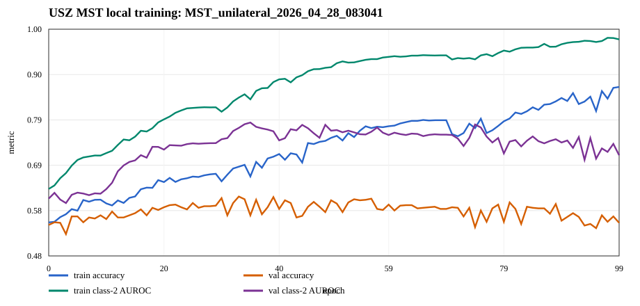

Retained checkpoints on external ODELIA challenge:
| Snapshot | Label | Internal val C2 AUROC | Internal val ACC | External C2 AUROC | External macro AUROC | External ACC | External C2 recall |
| --- | --- | --- | --- | --- | --- | --- | --- |
| USZ_MST_epoch33_best | epoch33_best | 0.774 | 0.617 | 0.723 | 0.612 | 0.363 | 0.486 |
| USZ_MST_last | last | 0.711 | 0.557 | 0.679 | 0.594 | 0.337 | 0.406 |

### USZ 1DC — `1DivideAndConquer_unilateral_2026_05_12_124440`
USZ local 1DivideAndConquer retry; available checkpoints are epoch 14 best and last.

| Field | Value |
| --- | --- |
| Internal train cohort | n=3448; 0=1911, 1=1244, 2=293 |
| Internal validation cohort | n=814; 0=450, 1=276, 2=88 |
| Internal best val ACC | epoch 26 / ACC 0.635 / C2 AUROC 0.791 |
| Internal best val Class-2 AUROC | epoch 39 / C2 AUROC 0.797 / ACC 0.612 |
| Internal last validation | epoch 99 / ACC 0.588 / C2 AUROC 0.752 |
| Internal last train | epoch 99 / ACC 0.926 / C2 AUROC 0.982 |
| Externally strongest retained checkpoint | `USZ_1DC_epoch14_best` / external C2 AUROC 0.810 / external macro AUROC 0.675 / internal C2 AUROC 0.786 |

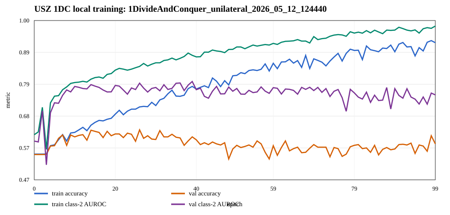

Retained checkpoints on external ODELIA challenge:
| Snapshot | Label | Internal val C2 AUROC | Internal val ACC | External C2 AUROC | External macro AUROC | External ACC | External C2 recall |
| --- | --- | --- | --- | --- | --- | --- | --- |
| USZ_1DC_epoch14_best | epoch14_best | 0.786 | 0.634 | 0.810 | 0.675 | 0.390 | 0.157 |
| USZ_1DC_last | last | 0.752 | 0.588 | 0.716 | 0.643 | 0.413 | 0.393 |

### UMCU MST — `MST_unilateral_2026_06_01_205145`
UMCU local MST artifacts supplied as a single zip on 2026-06-08. Lightning selected epoch 0 because `ModelCheckpoint` monitors `val/ACC`; in this run, validation accuracy is already maximized by the class-0 majority baseline. Later epochs improve AUROC/probability ranking but do not improve argmax accuracy or Class-2 recall.

| Field | Value |
| --- | --- |
| Internal train cohort | n=6134; 0=5338, 1=740, 2=56 |
| Internal validation cohort | n=1557; 0=1361, 1=186, 2=10 |
| Internal best val ACC | epoch 0 / ACC 0.874 / C2 AUROC 0.430 |
| Internal best val Class-2 AUROC | epoch 88 / C2 AUROC 0.845 / ACC 0.874 |
| Internal last validation | epoch 99 / ACC 0.871 / C2 AUROC 0.823 |
| Internal last train | epoch 99 / ACC 0.870 / C2 AUROC 0.758 |
| Externally strongest retained checkpoint | `UMCU_MST_last` / external C2 AUROC 0.624 / external macro AUROC 0.589 / internal C2 AUROC 0.823 |

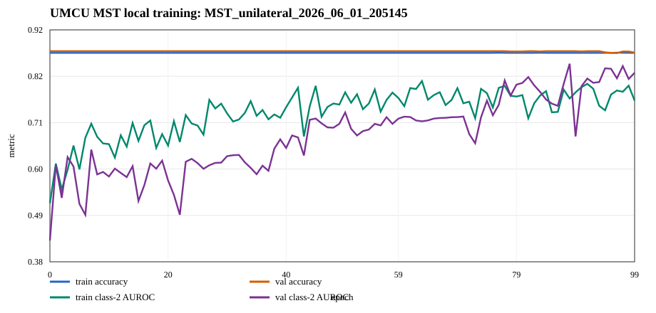


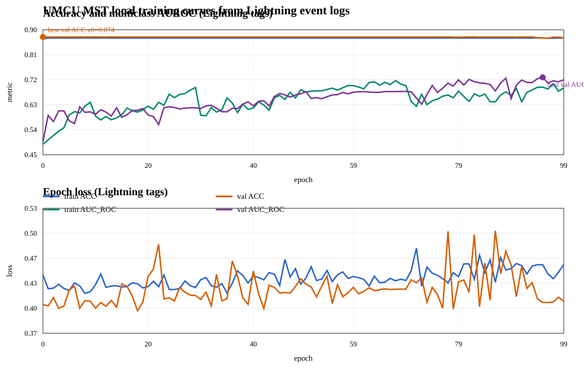

Retained checkpoints on external ODELIA challenge:
| Snapshot | Label | Internal val C2 AUROC | Internal val ACC | External C2 AUROC | External macro AUROC | External ACC | External C2 recall |
| --- | --- | --- | --- | --- | --- | --- | --- |
| UMCU_MST_last | last | 0.823 | 0.871 | 0.624 | 0.589 | 0.643 | 0.000 |
| UMCU_MST_epoch0_step767 | epoch0_step767 | 0.430 | 0.874 | 0.607 | 0.538 | 0.643 | 0.000 |

### UKA 1DC — `1DivideAndConquer_unilateral_2026_05_04_082228`
UKA local 1DivideAndConquer artifacts extracted from local Google Drive zip chunks.

| Field | Value |
| --- | --- |
| Internal train cohort | n=17834; 0=4747, 1=11836, 2=1251 |
| Internal validation cohort | n=4470; 0=1192, 1=2970, 2=308 |
| Internal best val ACC | epoch 25 / ACC 0.702 / C2 AUROC 0.921 |
| Internal best val Class-2 AUROC | epoch 21 / C2 AUROC 0.931 / ACC 0.686 |
| Internal last validation | epoch 99 / ACC 0.650 / C2 AUROC 0.861 |
| Internal last train | epoch 99 / ACC 0.960 / C2 AUROC 0.998 |
| Externally strongest retained checkpoint | `UKA_1DC_epoch25_step57980` / external C2 AUROC 0.858 / external macro AUROC 0.709 / internal C2 AUROC 0.921 |

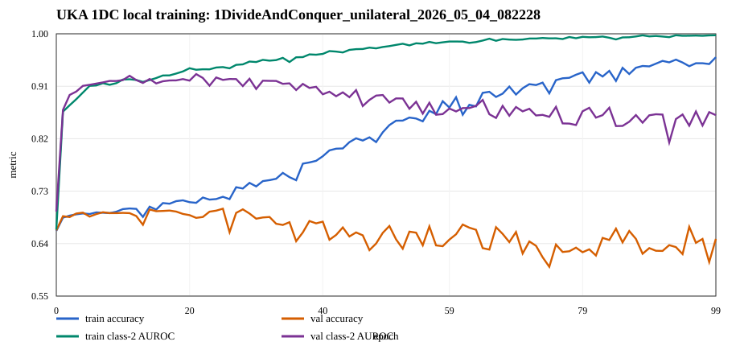

Retained checkpoints on external ODELIA challenge:
| Snapshot | Label | Internal val C2 AUROC | Internal val ACC | External C2 AUROC | External macro AUROC | External ACC | External C2 recall |
| --- | --- | --- | --- | --- | --- | --- | --- |
| UKA_1DC_epoch25_step57980 | epoch25_step57980 | 0.921 | 0.702 | 0.858 | 0.709 | 0.307 | 0.535 |
| UKA_1DC_last | last | 0.861 | 0.650 | 0.767 | 0.630 | 0.410 | 0.375 |

### CAM 1DC — `1DivideAndConquer_unilateral_2026_04_28_161733`
| Field | Value |
| --- | --- |
| Internal train cohort | n=970; 0=874, 1=60, 2=36 |
| Internal validation cohort | n=142; 0=120, 1=11, 2=11 |
| Internal best val ACC | epoch 73 / ACC 0.873 / C2 AUROC 0.953 |
| Internal best val Class-2 AUROC | epoch 37 / C2 AUROC 0.975 / ACC 0.859 |
| Internal last validation | epoch 99 / ACC 0.852 / C2 AUROC 0.940 |
| Internal last train | epoch 99 / ACC 0.938 / C2 AUROC 1.000 |
| Externally strongest retained checkpoint | `CAM_1DC_epoch52_step6466` / external C2 AUROC 0.682 / external macro AUROC 0.616 / internal C2 AUROC 0.965 |

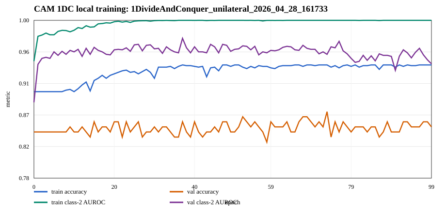

Retained checkpoints on external ODELIA challenge:
| Snapshot | Label | Internal val C2 AUROC | Internal val ACC | External C2 AUROC | External macro AUROC | External ACC | External C2 recall |
| --- | --- | --- | --- | --- | --- | --- | --- |
| CAM_1DC_epoch52_step6466 | epoch52_step6466 | 0.965 | 0.866 | 0.682 | 0.616 | 0.630 | 0.433 |
| CAM_1DC_last | last | 0.940 | 0.852 | 0.650 | 0.594 | 0.623 | 0.293 |
| CAM_1DC_epoch15_step1952 | epoch15_step1952 | 0.963 | 0.859 | 0.643 | 0.591 | 0.620 | 0.133 |
| CAM_1DC_epoch73_step9028 | epoch73_step9028 | 0.953 | 0.873 | 0.633 | 0.616 | 0.650 | 0.339 |
| CAM_1DC_epoch9_step1220 | epoch9_step1220 | 0.958 | 0.852 | 0.591 | 0.569 | 0.610 | 0.089 |
| CAM_1DC_epoch0_step122 | epoch0_step122 | 0.886 | 0.845 | 0.474 | 0.511 | 0.643 | 0.000 |

### MHA 1DC — `1DivideAndConquer_unilateral_2026_04_22_154631`
| Field | Value |
| --- | --- |
| Internal train cohort | n=810; 0=659, 1=70, 2=81 |
| Internal validation cohort | n=204; 0=167, 1=22, 2=15 |
| Internal best val ACC | epoch 77 / ACC 0.833 / C2 AUROC 0.711 |
| Internal best val Class-2 AUROC | epoch 30 / C2 AUROC 0.830 / ACC 0.819 |
| Internal last validation | epoch 99 / ACC 0.819 / C2 AUROC 0.667 |
| Internal last train | epoch 99 / ACC 0.909 / C2 AUROC 0.980 |
| Externally strongest retained checkpoint | `MHA_1DC_epoch37_step3876` / external C2 AUROC 0.795 / external macro AUROC 0.658 / internal C2 AUROC 0.808 |

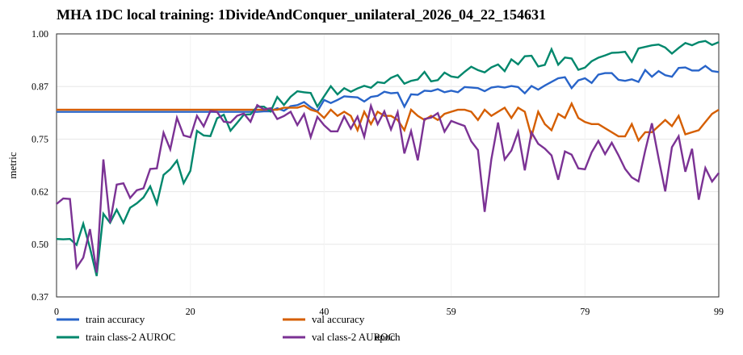

Retained checkpoints on external ODELIA challenge:
| Snapshot | Label | Internal val C2 AUROC | Internal val ACC | External C2 AUROC | External macro AUROC | External ACC | External C2 recall |
| --- | --- | --- | --- | --- | --- | --- | --- |
| MHA_1DC_epoch37_step3876 | epoch37_step3876 | 0.808 | 0.828 | 0.795 | 0.658 | 0.710 | 0.404 |
| MHA_1DC_epoch34_step3570 | epoch34_step3570 | 0.804 | 0.824 | 0.786 | 0.650 | 0.673 | 0.128 |
| MHA_1DC_last | last | 0.667 | 0.819 | 0.721 | 0.612 | 0.630 | 0.288 |
| MHA_1DC_epoch77_step7956 | epoch77_step7956 | 0.711 | 0.833 | 0.710 | 0.578 | 0.660 | 0.289 |
| MHA_1DC_epoch0_step102 | epoch0_step102 | 0.593 | 0.819 | 0.533 | 0.478 | 0.643 | 0.000 |

### RSH 1DC — `1DivideAndConquer_unilateral_2026_05_28_090751`
RSH local 1DivideAndConquer artifacts supplied as local tar/zip chunks on 2026-06-02.

| Field | Value |
| --- | --- |
| Internal train cohort | n=351; 0=4, 1=126, 2=221 |
| Internal validation cohort | n=87; 0=3, 1=32, 2=52 |
| Internal best val ACC | epoch 58 / ACC 0.655 / C2 AUROC 0.586 |
| Internal best val Class-2 AUROC | epoch 25 / C2 AUROC 0.618 / ACC 0.598 |
| Internal last validation | epoch 99 / ACC 0.621 / C2 AUROC 0.595 |
| Internal last train | epoch 99 / ACC 0.957 / C2 AUROC 0.985 |
| Externally strongest retained checkpoint | `RSH_1DC_epoch58_step2596` / external C2 AUROC 0.634 / external macro AUROC 0.585 / internal C2 AUROC 0.586 |

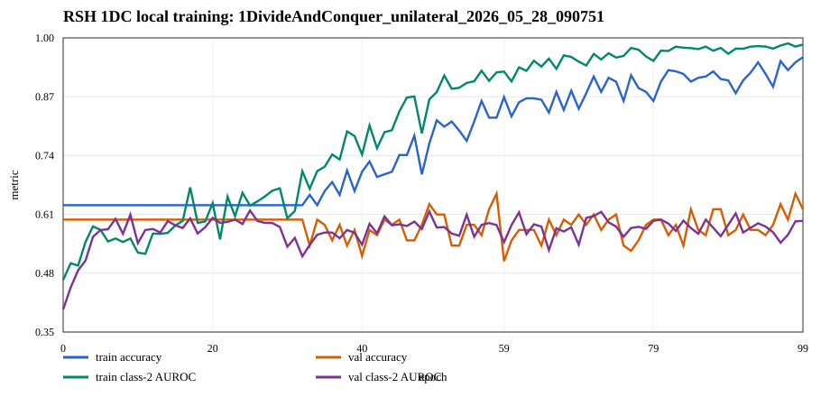

Retained checkpoints on external ODELIA challenge:
| Snapshot | Label | Internal val C2 AUROC | Internal val ACC | External C2 AUROC | External macro AUROC | External ACC | External C2 recall |
| --- | --- | --- | --- | --- | --- | --- | --- |
| RSH_1DC_epoch58_step2596 | epoch58_step2596 | 0.586 | 0.655 | 0.634 | 0.585 | 0.183 | 0.890 |
| RSH_1DC_last | last | 0.595 | 0.621 | 0.625 | 0.584 | 0.227 | 0.819 |

### RSH 5Pimed — `challenge_5pimed_unilateral_2026_04_03_182744`
RSH local 5Pimed run from the Cosmos dashboard mirror.

| Field | Value |
| --- | --- |
| Internal train cohort | n=351; 0=4, 1=126, 2=221 |
| Internal validation cohort | n=87; 0=3, 1=32, 2=52 |
| Internal best val ACC | epoch 13 / ACC 0.609 / C2 AUROC 0.669 |
| Internal best val Class-2 AUROC | epoch 12 / C2 AUROC 0.683 / ACC 0.540 |
| Internal last validation | epoch 24 / ACC 0.598 / C2 AUROC 0.620 |
| Internal last train | epoch 24 / ACC 0.630 / C2 AUROC 0.569 |
| Externally strongest retained checkpoint | `RSH_5Pimed_last` / external C2 AUROC 0.456 / external macro AUROC 0.498 / internal C2 AUROC 0.620 |

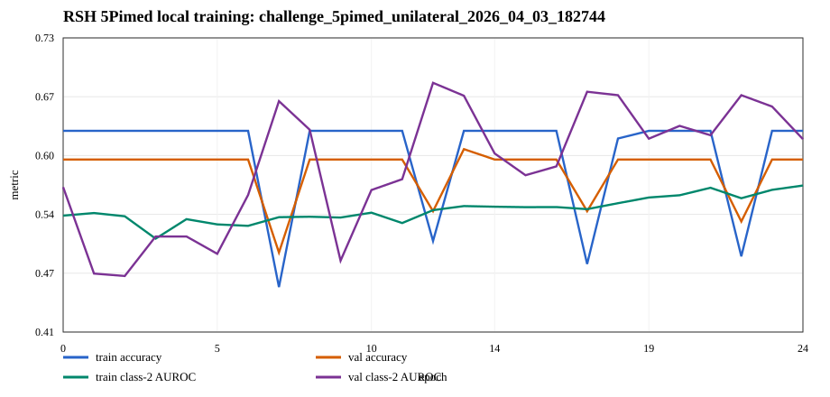

Retained checkpoints on external ODELIA challenge:
| Snapshot | Label | Internal val C2 AUROC | Internal val ACC | External C2 AUROC | External macro AUROC | External ACC | External C2 recall |
| --- | --- | --- | --- | --- | --- | --- | --- |
| RSH_5Pimed_last | last | 0.620 | 0.598 | 0.456 | 0.498 | 0.190 | 0.879 |
| RSH_5Pimed_epoch23_step8424 | epoch23_step8424 | 0.657 | 0.598 | 0.439 | 0.494 | 0.157 | 0.489 |

### RUMC MST — `MST_unilateral_2026_04_13_162111`
Short April RUMC MST run.

| Field | Value |
| --- | --- |
| Internal train cohort | n=940; 0=933, 1=3, 2=4 |
| Internal validation cohort | n=200; 0=199, 1=0, 2=1 |
| Internal best val ACC | epoch 0 / ACC 0.995 / C2 AUROC 0.558 |
| Internal best val Class-2 AUROC | epoch 0 / C2 AUROC 0.558 / ACC 0.995 |
| Internal last validation | epoch 0 / ACC 0.995 / C2 AUROC 0.558 |
| Internal last train | epoch 0 / ACC 0.993 / C2 AUROC 0.204 |
| Externally strongest retained checkpoint | `RUMC_MST_20260413_epoch0_step118` / external C2 AUROC 0.417 / external macro AUROC 0.501 / internal C2 AUROC 0.558 |

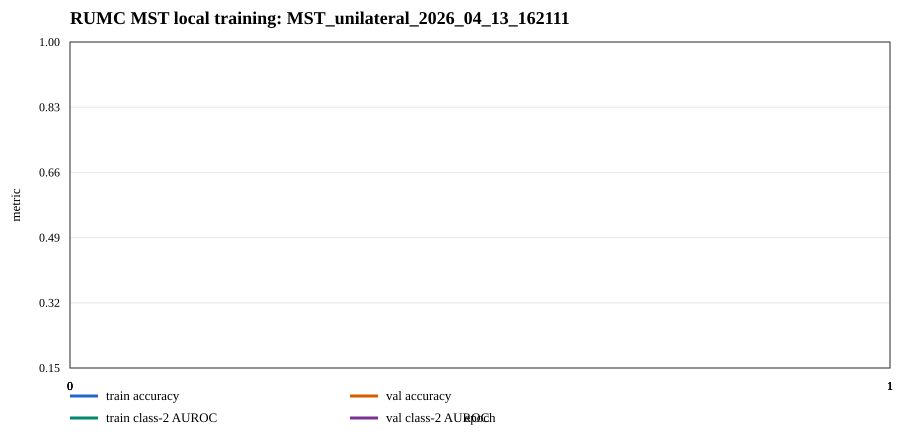

Retained checkpoints on external ODELIA challenge:
| Snapshot | Label | Internal val C2 AUROC | Internal val ACC | External C2 AUROC | External macro AUROC | External ACC | External C2 recall |
| --- | --- | --- | --- | --- | --- | --- | --- |
| RUMC_MST_20260413_epoch0_step118 | epoch0_step118 | 0.558 | 0.995 | 0.417 | 0.501 | 0.643 | 0.000 |
| RUMC_MST_20260413_last | last | 0.558 | 0.995 | 0.417 | 0.501 | 0.643 | 0.000 |

### RUMC MST — `MST_unilateral_2026_02_18_120355`
Earlier February RUMC MST run.

| Field | Value |
| --- | --- |
| Internal train cohort | n=940; 0=933, 1=3, 2=4 |
| Internal validation cohort | n=200; 0=199, 1=0, 2=1 |
| Internal best val ACC | epoch 0 / ACC 0.995 / C2 AUROC 0.764 |
| Internal best val Class-2 AUROC | epoch 5 / C2 AUROC 0.910 / ACC 0.995 |
| Internal last validation | epoch 99 / ACC 0.995 / C2 AUROC 0.568 |
| Internal last train | epoch 99 / ACC 0.996 / C2 AUROC 0.983 |
| Externally strongest retained checkpoint | `RUMC_MST_20260218_last` / external C2 AUROC 0.523 / external macro AUROC 0.495 / internal C2 AUROC 0.568 |

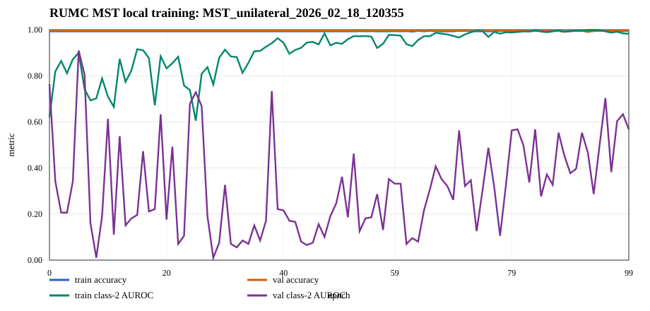

Retained checkpoints on external ODELIA challenge:
| Snapshot | Label | Internal val C2 AUROC | Internal val ACC | External C2 AUROC | External macro AUROC | External ACC | External C2 recall |
| --- | --- | --- | --- | --- | --- | --- | --- |
| RUMC_MST_20260218_last | last | 0.568 | 0.995 | 0.523 | 0.495 | 0.643 | 0.000 |
| RUMC_MST_20260218_epoch0_step940 | epoch0_step940 | 0.764 | 0.995 | 0.475 | 0.523 | 0.643 | 0.000 |

## ODELIA Challenge Evaluation
Completed per-site checkpoint evaluations: **162** rows in `workspace/odelia_single_site_eval/tables/challenge_summary_metrics.csv`.

### Top Checkpoints by Weighted Mean Class-2 AUROC
| Snapshot | Source | Model | Class-2 AUROC | Macro AUROC | Accuracy | Class-2 Recall |
| --- | --- | --- | --- | --- | --- | --- |
| UKA_1DC_epoch25_step57980 | UKA | 1DC | 0.858 | 0.709 | 0.307 | 0.535 |
| USZ_1DC_epoch14_best | USZ | 1DC | 0.810 | 0.675 | 0.390 | 0.157 |
| MHA_1DC_epoch37_step3876 | MHA | 1DC | 0.795 | 0.658 | 0.710 | 0.404 |
| MHA_1DC_epoch34_step3570 | MHA | 1DC | 0.786 | 0.650 | 0.673 | 0.128 |
| UKA_1DC_last | UKA | 1DC | 0.767 | 0.630 | 0.410 | 0.375 |
| USZ_MST_epoch33_best | USZ | MST | 0.723 | 0.612 | 0.363 | 0.486 |
| MHA_1DC_last | MHA | 1DC | 0.721 | 0.612 | 0.630 | 0.288 |
| USZ_1DC_last | USZ | 1DC | 0.716 | 0.643 | 0.413 | 0.393 |
| MHA_1DC_epoch77_step7956 | MHA | 1DC | 0.710 | 0.578 | 0.660 | 0.289 |
| CAM_1DC_epoch52_step6466 | CAM | 1DC | 0.682 | 0.616 | 0.630 | 0.433 |
| USZ_MST_last | USZ | MST | 0.679 | 0.594 | 0.337 | 0.406 |
| CAM_1DC_last | CAM | 1DC | 0.650 | 0.594 | 0.623 | 0.293 |

### Top Checkpoints by Weighted Mean Macro AUROC
| Snapshot | Source | Model | Macro AUROC | Class-2 AUROC | Accuracy |
| --- | --- | --- | --- | --- | --- |
| UKA_1DC_epoch25_step57980 | UKA | 1DC | 0.709 | 0.858 | 0.307 |
| USZ_1DC_epoch14_best | USZ | 1DC | 0.675 | 0.810 | 0.390 |
| MHA_1DC_epoch37_step3876 | MHA | 1DC | 0.658 | 0.795 | 0.710 |
| MHA_1DC_epoch34_step3570 | MHA | 1DC | 0.650 | 0.786 | 0.673 |
| USZ_1DC_last | USZ | 1DC | 0.643 | 0.716 | 0.413 |
| UKA_1DC_last | UKA | 1DC | 0.630 | 0.767 | 0.410 |
| CAM_1DC_epoch52_step6466 | CAM | 1DC | 0.616 | 0.682 | 0.630 |
| CAM_1DC_epoch73_step9028 | CAM | 1DC | 0.616 | 0.633 | 0.650 |
| USZ_MST_epoch33_best | USZ | MST | 0.612 | 0.723 | 0.363 |
| MHA_1DC_last | MHA | 1DC | 0.612 | 0.721 | 0.630 |
| CAM_1DC_last | CAM | 1DC | 0.594 | 0.650 | 0.623 |
| USZ_MST_last | USZ | MST | 0.594 | 0.679 | 0.337 |

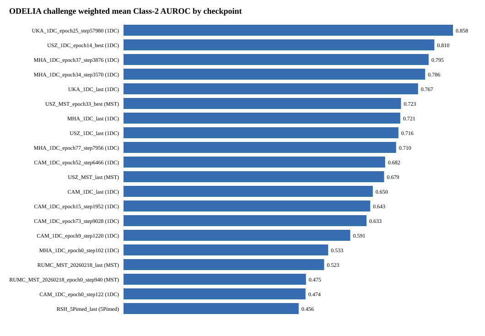

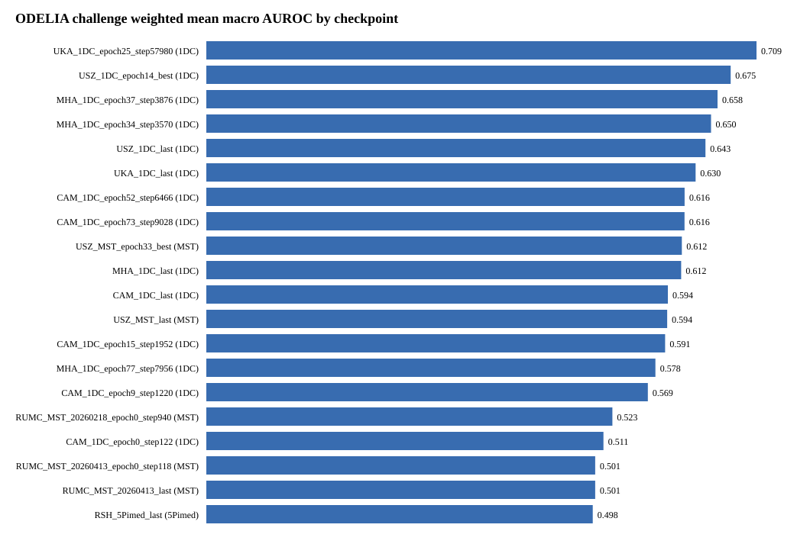

## USZ Partner Supplement
Comparable USZ training, class-distribution, curve, and external ODELIA challenge fields are included in the per-source section above. This supplement records USZ-specific deployment/data-hygiene notes and the supplemental Duke cross-evaluation.
USZ `Data_all/USZ_1` contains **5413 annotated unilateral UIDs** and **5312 split UIDs**. Class distribution is 0=3046, 1=1875, 2=492 (Class 2/Malignant is about 9%). All split UIDs have image data (`split_uids_missing_image=0`); 101 annotated UIDs are excluded by the split and 6346 image directories are unused by this fold.
The trainer plausibility audit reported no duplicate UID or split-overlap errors. The remaining warnings were non-blocking: 4 byte-identical image-data groups, annotation/split/image set drift, and unused image directories from older preprocessing output.

### Supplemental USZ MST -> Duke Held-Out Test
| Snapshot | Kind | Samples | ACC | Class-2 AUROC | Class-2 Recall | Class-2 F1 |
| --- | --- | --- | --- | --- | --- | --- |
| USZ_MST_best | best | 262 | 0.389 | 0.717 | 0.496 | 0.594 |
| USZ_MST_last | single | 262 | 0.321 | 0.747 | 0.343 | 0.482 |

These Duke numbers are supplemental binary 0-vs-2 cross-evaluation results for the USZ-trained MST checkpoints; Duke has no true class-1 labels in this slice.

### USZ Data and Output Footprint
- `Data_all/USZ_1` is about **114 GB** total; the unilateral training directory is about **17 GB** / 11,657 `Sub_1.nii.gz` files.
- Each fold-0 100-epoch local-training run reads about **6.4 GB unique** training+validation data and roughly **640 GB logical epoch I/O**, mostly served from OS page cache after the first pass.
- MST writes about **840 MB** of run output; 1DC writes about **3.1 GB** because each checkpoint is about 1.1 GB.
- USZ artifacts are under `workspace/usz_partner_eval/`, and the unified challenge-eval outputs are under `workspace/odelia_single_site_eval/`.

## Reference Swarm/Artifact Context
Two source reports are appended verbatim at the end of this document so the single-site checkpoint findings can be read against the existing swarm-artifact evidence.

### Challenge Swarm/Local Package, 2026-05-13
The challenge-swarm package is a six-model swarm/local artifact audit with complete final artifacts across CAM_1, MHA_1, RSH_1, RUMC_1, UKA_1, and UMCU_1. Its metrics are **internal validation streams**, not the external checkpoint-on-challenge-test endpoint used for the single-site comparison above.

| Model | Best aggregated val AUROC | Best site val AUROC | Status |
| --- | --- | --- | --- |
| MST | 0.775 @ 104 | 0.801 @ 159 | complete artifacts |
| 1DivideAndConquer | 0.811 @ 128 | 0.870 @ 120 | complete artifacts |
| 2BCN_AIM | 0.760 @ 144 | 0.775 @ 109 | complete artifacts |
| 3agaldran | 0.830 @ 152 | 0.902 @ 180 | complete artifacts |
| 4LME_ABMIL | 0.900 @ 40 | 0.910 @ 140 | complete artifacts |
| 5Pimed | 0.789 @ 180 | 0.866 @ 145 | complete artifacts after retry |

### OLE/Duke Swarm Package
The OLE/Duke package is a three-node Duke swarm artifact audit. It is retained as source context because it documents the older Duke swarm result, including the important caveats around train/validation/test UID overlap warnings and failed global-best selection.

## Methods
- Checkpoints are loaded as PyTorch Lightning `.ckpt` files through `scripts/evaluation/predict.py --checkpoint-type lightning`.
- Inference runs on `dd-dl0` with Docker image `jefftud/odelia:1.4.3-dev.260427.ab6397b` and challenge data root `/mnt/dlhd0/medswarmdata`.
- Evaluated ODELIA challenge target sites: `CAM`, `MHA`, `RSH`, `RUMC`, `UKA`, `UMCU`.
- Training curves are computed from `site_model_gt_and_classprob_{train,validation}.csv`, whose rows are `epoch, ground_truth, prob_class_0, prob_class_1, prob_class_2`.
- Class-distribution tables are written to `workspace/odelia_single_site_eval/tables/internal_class_distribution.csv` and `workspace/odelia_single_site_eval/tables/external_challenge_class_distribution.csv`.
- Partner workbook for Google Sheets import: [docs/supplementary/ODELIA_single_site_checkpoint_results_20260608.xlsx](supplementary/ODELIA_single_site_checkpoint_results_20260608.xlsx).

## Open Items
- Confirm whether any unavailable intermediate checkpoints (for example an epoch-36 USZ 1DC checkpoint) were retained elsewhere; the USZ run currently exposes epoch-14 best and last only.
- Decide whether exact `last.ckpt` / `last_global_model.ckpt` duplicates should be kept as aliases in the final table or collapsed entirely.

---

# Appended Source Context: ODELIA Challenge Swarm/Local Artifact Report

# ODELIA Challenge Swarm/Local Artifact Report

> Generated by `scripts/evaluation/generate_challenge_swarm_local_report.py` from the extracted `20260513_ChallengeSwarmLocalTests` package.

## Executive Summary

- The archive is present at `/mnt/nvme0n1p1/Jeff_projects/Odelia_local_training/challenge_training/20260513_ChallengeSwarmLocalTests.tar.gz` with size `38,700,462,176` bytes and mtime `2026-05-20T10:23:17Z`.
- The extracted package is indexed at `/mnt/nvme0n1p1/Jeff_projects/Odelia_local_training/challenge_training/20260513_ChallengeSwarmLocalTests`; the archive layout is site-first (`<SITE>/<JOB_ID>/...`) plus scratch run directories.
- Final run coverage is `6/6` models with complete global-model artifacts across the expected sites.
- Failed/retried runs are kept separate from the final model matrix: `5Pimed` failed once before succeeding, and `MST` has one failed job with no mapped run directory before succeeding.
- `00ec8d75-6c4a-4ccd-89c2-fc68dc9a91f7` is treated as swarm preflight and ignored for model-quality interpretation.
- Metadata status values are stale/incomplete in this package (`SUBMITTED`: 54); the report cross-checks logs, run folders, checkpoints, and CSVs instead.
- All parsed validation CSVs include class `1`; three-class AUROC is therefore defined for these streams.

## Transfer and Extraction

| Field | Value |
| --- | --- |
| Archive | `/mnt/nvme0n1p1/Jeff_projects/Odelia_local_training/challenge_training/20260513_ChallengeSwarmLocalTests.tar.gz` |
| Archive size | `38,700,462,176` bytes |
| Archive mtime | `2026-05-20T10:23:17Z` |
| Extracted directory | `/mnt/nvme0n1p1/Jeff_projects/Odelia_local_training/challenge_training/20260513_ChallengeSwarmLocalTests` |
| Expected final models | `MST`, `1DivideAndConquer`, `2BCN_AIM`, `3agaldran`, `4LME_ABMIL`, `5Pimed` |
| Expected sites | `CAM_1`, `MHA_1`, `RSH_1`, `RUMC_1`, `UKA_1`, `UMCU_1` |
| Derived summaries | `workspace/report_outputs/challenge_swarm_local_tests_20260513` |

## Final Run Matrix

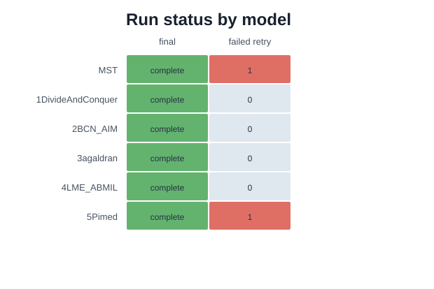

| Model | Job ID | Mapped run | Status | Global models | Run dirs | CSV sites | Log span | Best agg val AUROC | Best site val AUROC |
| --- | --- | --- | --- | --- | --- | --- | --- | --- | --- |
| MST | `74aa125a...` | `MST_unilateral_2026_05_18_140641` | complete artifacts | 6/6 | 6/6 | 6/6 | 4h 34m 27s | 0.775 @ 104 | 0.801 @ 159 |
| 1DivideAndConquer | `4cf67437...` | `1DivideAndConquer_unilateral_2026_05_13_090404` | complete artifacts | 6/6 | 6/6 | 6/6 | 11h 52m 51s | 0.811 @ 128 | 0.870 @ 120 |
| 2BCN_AIM | `90c5f582...` | `2BCN_AIM_unilateral_2026_05_13_205634` | complete artifacts | 6/6 | 6/6 | 6/6 | 17h 56m 19s | 0.760 @ 144 | 0.775 @ 109 |
| 3agaldran | `8f1f7a2b...` | `3agaldran_unilateral_2026_05_14_145249` | complete artifacts | 6/6 | 6/6 | 6/6 | 6h 21m 45s | 0.830 @ 152 | 0.902 @ 180 |
| 4LME_ABMIL | `044db8c1...` | `4LME_ABMIL_unilateral_2026_05_14_211439` | complete artifacts | 6/6 | 6/6 | 6/6 | 6h 33m 16s | 0.900 @ 40 | 0.910 @ 140 |
| 5Pimed | `7463a272...` | `5Pimed_unilateral_2026_05_18_090219` | complete artifacts | 6/6 | 6/6 | 6/6 | 5h 04m 19s | 0.789 @ 180 | 0.866 @ 145 |

## Artifact Coverage

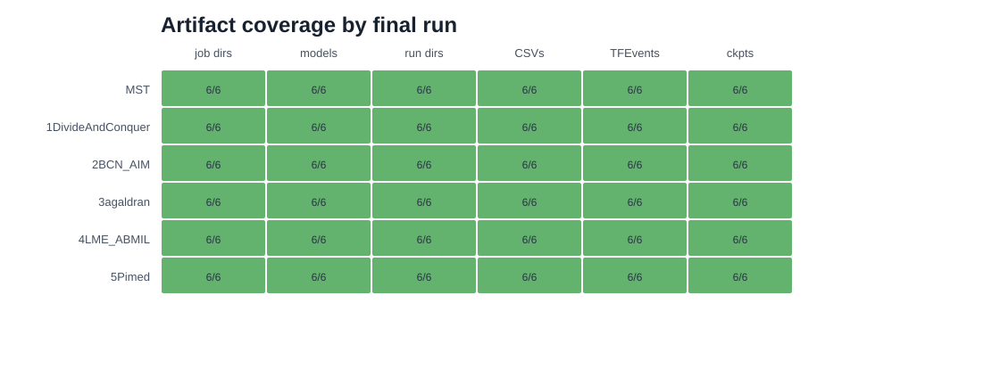

| Model | Job dirs | Global models | Run dirs | CSV files | TFEvents | Local ckpts | Non-empty error logs |
| --- | --- | --- | --- | --- | --- | --- | --- |
| MST | 6/6 | 6/6 | 6/6 | 12 validation / 12 train | 6/6 | 6/6 | none |
| 1DivideAndConquer | 6/6 | 6/6 | 6/6 | 12 validation / 12 train | 6/6 | 6/6 | none |
| 2BCN_AIM | 6/6 | 6/6 | 6/6 | 12 validation / 12 train | 6/6 | 6/6 | none |
| 3agaldran | 6/6 | 6/6 | 6/6 | 12 validation / 12 train | 6/6 | 6/6 | none |
| 4LME_ABMIL | 6/6 | 6/6 | 6/6 | 12 validation / 12 train | 6/6 | 6/6 | none |
| 5Pimed | 6/6 | 6/6 | 6/6 | 12 validation / 12 train | 6/6 | 6/6 | none |

### Site Coverage

| Site | Job dirs | Run dirs | CSV coverage | Missing run dirs |
| --- | --- | --- | --- | --- |
| CAM_1 | 6/6 | 6/6 | 6/6 | none |
| MHA_1 | 6/6 | 6/6 | 6/6 | none |
| RSH_1 | 6/6 | 6/6 | 6/6 | none |
| RUMC_1 | 6/6 | 6/6 | 6/6 | none |
| UKA_1 | 6/6 | 6/6 | 6/6 | none |
| UMCU_1 | 6/6 | 6/6 | 6/6 | none |

## Validation Metrics

Metrics below are recomputed from `*_gt_and_classprob_validation.csv`. AUROC is one-vs-rest averaged over classes that have both positive and negative samples in a stream.

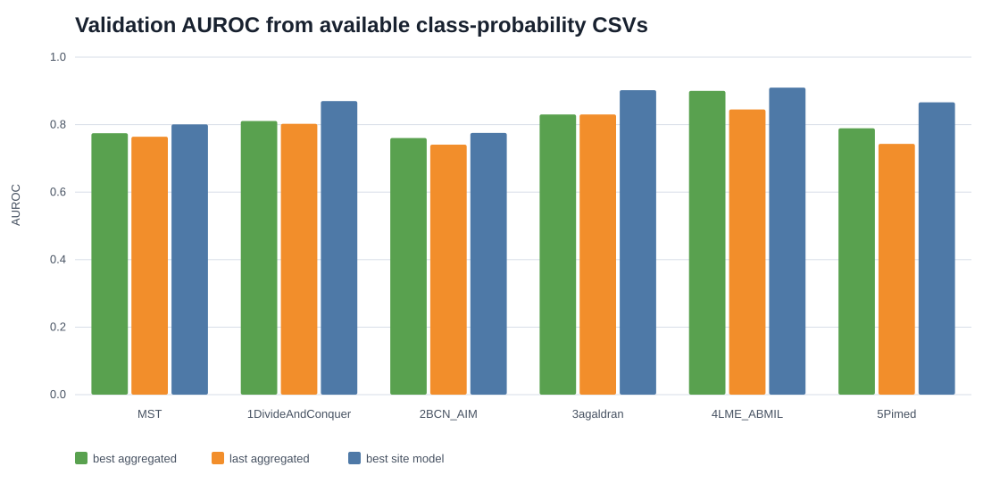

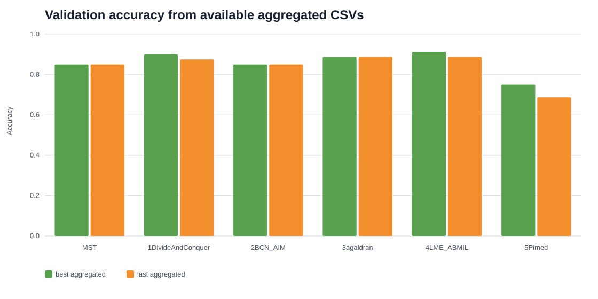

Full validation stream table is also available as `workspace/report_outputs/challenge_swarm_local_tests_20260513/validation_metrics_summary.csv`.

| Model | Site | Stream | Epochs | Samples/epoch | Labels | Best AUROC | Best ACC | Last AUROC/ACC |
| --- | --- | --- | --- | --- | --- | --- | --- | --- |
| MST | CAM_1 | aggregated | 20 | 80 | `0:57, 1:5, 2:18` | 0.775 @ 104 | 0.850 @ 88 | 0.764 / 0.850 |
| MST | CAM_1 | site | 160 | 80 | `0:57, 1:5, 2:18` | 0.801 @ 159 | 0.875 @ 106 | 0.801 / 0.838 |
| MST | MHA_1 | aggregated | 20 | 32 | `0:20, 1:3, 2:9` | 0.599 @ 190 | 0.625 @ 0 | 0.599 / 0.531 |
| MST | MHA_1 | site | 200 | 32 | `0:20, 1:3, 2:9` | 0.733 @ 73 | 0.656 @ 42 | 0.571 / 0.594 |
| MST | RSH_1 | aggregated | 20 | 32 | `0:22, 1:2, 2:8` | 0.667 @ 0 | 0.688 @ 0 | 0.547 / 0.656 |
| MST | RSH_1 | site | 200 | 32 | `0:22, 1:2, 2:8` | 0.755 @ 4 | 0.750 @ 150 | 0.651 / 0.688 |
| MST | RUMC_1 | aggregated | 20 | 10 | `0:4, 1:2, 2:4` | 0.701 @ 80 | 0.400 @ 0 | 0.639 / 0.400 |
| MST | RUMC_1 | site | 200 | 10 | `0:4, 1:2, 2:4` | 0.750 @ 91 | 0.500 @ 47 | 0.542 / 0.400 |
| MST | UKA_1 | aggregated | 20 | 32 | `0:19, 1:7, 2:6` | 0.508 @ 150 | 0.594 @ 0 | 0.491 / 0.594 |
| MST | UKA_1 | site | 200 | 32 | `0:19, 1:7, 2:6` | 0.590 @ 16 | 0.625 @ 28 | 0.425 / 0.438 |
| MST | UMCU_1 | aggregated | 20 | 52 | `0:30, 1:11, 2:11` | 0.671 @ 160 | 0.577 @ 0 | 0.641 / 0.577 |
| MST | UMCU_1 | site | 200 | 52 | `0:30, 1:11, 2:11` | 0.656 @ 155 | 0.615 @ 60 | 0.586 / 0.538 |
| 1DivideAndConquer | CAM_1 | aggregated | 20 | 80 | `0:57, 1:5, 2:18` | 0.811 @ 128 | 0.900 @ 64 | 0.802 / 0.875 |
| 1DivideAndConquer | CAM_1 | site | 160 | 80 | `0:57, 1:5, 2:18` | 0.870 @ 120 | 0.887 @ 17 | 0.791 / 0.875 |
| 1DivideAndConquer | MHA_1 | aggregated | 20 | 32 | `0:20, 1:3, 2:9` | 0.707 @ 170 | 0.719 @ 50 | 0.704 / 0.656 |
| 1DivideAndConquer | MHA_1 | site | 200 | 32 | `0:20, 1:3, 2:9` | 0.846 @ 177 | 0.781 @ 34 | 0.721 / 0.750 |
| 1DivideAndConquer | RSH_1 | aggregated | 20 | 32 | `0:22, 1:2, 2:8` | 0.524 @ 0 | 0.719 @ 30 | 0.431 / 0.688 |
| 1DivideAndConquer | RSH_1 | site | 200 | 32 | `0:22, 1:2, 2:8` | 0.656 @ 27 | 0.750 @ 85 | 0.438 / 0.500 |
| 1DivideAndConquer | RUMC_1 | aggregated | 20 | 10 | `0:4, 1:2, 2:4` | 0.688 @ 60 | 0.600 @ 50 | 0.375 / 0.200 |
| 1DivideAndConquer | RUMC_1 | site | 200 | 10 | `0:4, 1:2, 2:4` | 0.868 @ 138 | 0.700 @ 63 | 0.521 / 0.400 |
| 1DivideAndConquer | UKA_1 | aggregated | 20 | 32 | `0:19, 1:7, 2:6` | 0.701 @ 70 | 0.656 @ 30 | 0.531 / 0.625 |
| 1DivideAndConquer | UKA_1 | site | 200 | 32 | `0:19, 1:7, 2:6` | 0.703 @ 100 | 0.688 @ 84 | 0.557 / 0.531 |
| 1DivideAndConquer | UMCU_1 | aggregated | 20 | 52 | `0:30, 1:11, 2:11` | 0.749 @ 50 | 0.692 @ 90 | 0.679 / 0.596 |
| 1DivideAndConquer | UMCU_1 | site | 200 | 52 | `0:30, 1:11, 2:11` | 0.777 @ 72 | 0.673 @ 46 | 0.742 / 0.615 |
| 2BCN_AIM | CAM_1 | aggregated | 20 | 80 | `0:57, 1:5, 2:18` | 0.760 @ 144 | 0.850 @ 128 | 0.741 / 0.850 |
| 2BCN_AIM | CAM_1 | site | 160 | 80 | `0:57, 1:5, 2:18` | 0.775 @ 109 | 0.863 @ 99 | 0.756 / 0.838 |
| 2BCN_AIM | MHA_1 | aggregated | 20 | 32 | `0:20, 1:3, 2:9` | 0.681 @ 10 | 0.625 @ 10 | 0.577 / 0.562 |
| 2BCN_AIM | MHA_1 | site | 200 | 32 | `0:20, 1:3, 2:9` | 0.675 @ 38 | 0.688 @ 49 | 0.586 / 0.594 |
| 2BCN_AIM | RSH_1 | aggregated | 20 | 32 | `0:22, 1:2, 2:8` | 0.426 @ 180 | 0.688 @ 10 | 0.412 / 0.688 |
| 2BCN_AIM | RSH_1 | site | 200 | 32 | `0:22, 1:2, 2:8` | 0.575 @ 172 | 0.750 @ 172 | 0.466 / 0.594 |
| 2BCN_AIM | RUMC_1 | aggregated | 20 | 10 | `0:4, 1:2, 2:4` | 0.521 @ 0 | 0.400 @ 10 | 0.236 / 0.400 |
| 2BCN_AIM | RUMC_1 | site | 200 | 10 | `0:4, 1:2, 2:4` | 0.674 @ 1 | 0.400 @ 0 | 0.312 / 0.400 |
| 2BCN_AIM | UKA_1 | aggregated | 20 | 32 | `0:19, 1:7, 2:6` | 0.590 @ 0 | 0.594 @ 10 | 0.579 / 0.562 |
| 2BCN_AIM | UKA_1 | site | 200 | 32 | `0:19, 1:7, 2:6` | 0.585 @ 20 | 0.594 @ 0 | 0.494 / 0.406 |
| 2BCN_AIM | UMCU_1 | aggregated | 20 | 52 | `0:30, 1:11, 2:11` | 0.675 @ 110 | 0.596 @ 110 | 0.553 / 0.577 |
| 2BCN_AIM | UMCU_1 | site | 200 | 52 | `0:30, 1:11, 2:11` | 0.634 @ 10 | 0.615 @ 77 | 0.550 / 0.538 |
| 3agaldran | CAM_1 | aggregated | 20 | 80 | `0:57, 1:5, 2:18` | 0.830 @ 152 | 0.887 @ 56 | 0.830 / 0.887 |
| 3agaldran | CAM_1 | site | 160 | 80 | `0:57, 1:5, 2:18` | 0.868 @ 143 | 0.900 @ 87 | 0.803 / 0.875 |
| 3agaldran | MHA_1 | aggregated | 20 | 32 | `0:20, 1:3, 2:9` | 0.777 @ 50 | 0.781 @ 110 | 0.678 / 0.625 |
| 3agaldran | MHA_1 | site | 200 | 32 | `0:20, 1:3, 2:9` | 0.902 @ 180 | 0.844 @ 82 | 0.792 / 0.688 |
| 3agaldran | RSH_1 | aggregated | 20 | 32 | `0:22, 1:2, 2:8` | 0.757 @ 20 | 0.781 @ 20 | 0.465 / 0.688 |
| 3agaldran | RSH_1 | site | 200 | 32 | `0:22, 1:2, 2:8` | 0.715 @ 16 | 0.781 @ 18 | 0.579 / 0.656 |
| 3agaldran | RUMC_1 | aggregated | 20 | 10 | `0:4, 1:2, 2:4` | 0.722 @ 70 | 0.600 @ 80 | 0.500 / 0.600 |
| 3agaldran | RUMC_1 | site | 200 | 10 | `0:4, 1:2, 2:4` | 0.889 @ 110 | 0.700 @ 64 | 0.556 / 0.500 |
| 3agaldran | UKA_1 | aggregated | 20 | 32 | `0:19, 1:7, 2:6` | 0.773 @ 100 | 0.719 @ 50 | 0.755 / 0.688 |
| 3agaldran | UKA_1 | site | 200 | 32 | `0:19, 1:7, 2:6` | 0.826 @ 163 | 0.750 @ 102 | 0.691 / 0.438 |
| 3agaldran | UMCU_1 | aggregated | 20 | 52 | `0:30, 1:11, 2:11` | 0.715 @ 60 | 0.654 @ 80 | 0.585 / 0.519 |
| 3agaldran | UMCU_1 | site | 200 | 52 | `0:30, 1:11, 2:11` | 0.773 @ 82 | 0.692 @ 77 | 0.653 / 0.635 |
| 4LME_ABMIL | CAM_1 | aggregated | 20 | 80 | `0:57, 1:5, 2:18` | 0.900 @ 40 | 0.912 @ 32 | 0.845 / 0.887 |
| 4LME_ABMIL | CAM_1 | site | 160 | 80 | `0:57, 1:5, 2:18` | 0.884 @ 19 | 0.900 @ 19 | 0.760 / 0.875 |
| 4LME_ABMIL | MHA_1 | aggregated | 20 | 32 | `0:20, 1:3, 2:9` | 0.764 @ 80 | 0.750 @ 60 | 0.639 / 0.688 |
| 4LME_ABMIL | MHA_1 | site | 200 | 32 | `0:20, 1:3, 2:9` | 0.868 @ 65 | 0.844 @ 33 | 0.771 / 0.719 |
| 4LME_ABMIL | RSH_1 | aggregated | 20 | 32 | `0:22, 1:2, 2:8` | 0.746 @ 180 | 0.719 @ 80 | 0.664 / 0.688 |
| 4LME_ABMIL | RSH_1 | site | 200 | 32 | `0:22, 1:2, 2:8` | 0.803 @ 185 | 0.781 @ 175 | 0.710 / 0.625 |
| 4LME_ABMIL | RUMC_1 | aggregated | 20 | 10 | `0:4, 1:2, 2:4` | 0.826 @ 90 | 0.700 @ 60 | 0.590 / 0.700 |
| 4LME_ABMIL | RUMC_1 | site | 200 | 10 | `0:4, 1:2, 2:4` | 0.910 @ 140 | 0.700 @ 36 | 0.562 / 0.500 |
| 4LME_ABMIL | UKA_1 | aggregated | 20 | 32 | `0:19, 1:7, 2:6` | 0.845 @ 70 | 0.812 @ 50 | 0.820 / 0.719 |
| 4LME_ABMIL | UKA_1 | site | 200 | 32 | `0:19, 1:7, 2:6` | 0.885 @ 160 | 0.781 @ 42 | 0.701 / 0.594 |
| 4LME_ABMIL | UMCU_1 | aggregated | 20 | 52 | `0:30, 1:11, 2:11` | 0.708 @ 110 | 0.615 @ 20 | 0.668 / 0.615 |
| 4LME_ABMIL | UMCU_1 | site | 200 | 52 | `0:30, 1:11, 2:11` | 0.762 @ 33 | 0.692 @ 132 | 0.615 / 0.577 |
| 5Pimed | CAM_1 | aggregated | 20 | 80 | `0:57, 1:5, 2:18` | 0.781 @ 40 | 0.863 @ 56 | 0.685 / 0.838 |
| 5Pimed | CAM_1 | site | 160 | 80 | `0:57, 1:5, 2:18` | 0.866 @ 145 | 0.875 @ 27 | 0.798 / 0.787 |
| 5Pimed | MHA_1 | aggregated | 20 | 32 | `0:20, 1:3, 2:9` | 0.789 @ 180 | 0.750 @ 50 | 0.743 / 0.688 |
| 5Pimed | MHA_1 | site | 200 | 32 | `0:20, 1:3, 2:9` | 0.843 @ 168 | 0.812 @ 79 | 0.781 / 0.719 |
| 5Pimed | RSH_1 | aggregated | 20 | 32 | `0:22, 1:2, 2:8` | 0.609 @ 90 | 0.719 @ 160 | 0.537 / 0.656 |
| 5Pimed | RSH_1 | site | 200 | 32 | `0:22, 1:2, 2:8` | 0.656 @ 121 | 0.719 @ 35 | 0.391 / 0.562 |
| 5Pimed | RUMC_1 | aggregated | 20 | 10 | `0:4, 1:2, 2:4` | 0.778 @ 100 | 0.700 @ 70 | 0.653 / 0.600 |
| 5Pimed | RUMC_1 | site | 200 | 10 | `0:4, 1:2, 2:4` | 0.854 @ 43 | 0.700 @ 42 | 0.625 / 0.600 |
| 5Pimed | UKA_1 | aggregated | 20 | 32 | `0:19, 1:7, 2:6` | 0.613 @ 30 | 0.625 @ 170 | 0.516 / 0.625 |
| 5Pimed | UKA_1 | site | 200 | 32 | `0:19, 1:7, 2:6` | 0.691 @ 176 | 0.656 @ 128 | 0.632 / 0.438 |
| 5Pimed | UMCU_1 | aggregated | 20 | 52 | `0:30, 1:11, 2:11` | 0.712 @ 130 | 0.596 @ 50 | 0.676 / 0.577 |
| 5Pimed | UMCU_1 | site | 200 | 52 | `0:30, 1:11, 2:11` | 0.770 @ 120 | 0.654 @ 180 | 0.673 / 0.615 |

## External Validation Metrics

External validation evaluates retained artifacts on the ODELIA challenge test institutions (`CAM`, `MHA`, `RSH`, `RUMC`, `UKA`, `UMCU`) using `scripts/evaluation/predict.py` on `dd-dl0:/mnt/dlhd0/medswarmdata`.

The comparison below is deliberately artifact-based: **Swarm global final** is one representative final `FL_global_model.pt` from the completed swarm run, and **Best site-local retained** is the retained non-last local checkpoint from the site with the highest internal site-stream validation AUROC for that model. No separate pooled centralized checkpoint family was found in this package, so the site-local retained checkpoint is the available local/centralized-style comparator.

Aggregate external metrics are weighted by samples across the six external sites. Per-site rows are available in `workspace/report_outputs/challenge_swarm_local_tests_20260513/external_metrics_by_eval_site.csv`; the target manifest is `workspace/report_outputs/challenge_swarm_local_tests_20260513/external_eval_manifest.json`.

| Model | Artifact | Source site | Checkpoint | Internal val AUROC | External C2 AUROC | External macro AUROC | External ACC | External C2 recall | Samples |
| --- | --- | --- | --- | --- | --- | --- | --- | --- | --- |
| MST | Swarm global final | CAM_1 | `FL_global_model.pt` | 0.644 | 0.755 | 0.645 | 0.600 | 0.441 | 300 |
| MST | Best site-local retained | CAM_1 | `epoch=106-step=4280.ckpt` | 0.801 | 0.747 | 0.635 | 0.573 | 0.448 | 300 |
| 1DivideAndConquer | Swarm global final | CAM_1 | `FL_global_model.pt` | 0.658 | 0.824 | 0.708 | 0.730 | 0.654 | 300 |
| 1DivideAndConquer | Best site-local retained | CAM_1 | `epoch=17-step=720.ckpt` | 0.870 | 0.807 | 0.609 | 0.703 | 0.532 | 300 |
| 2BCN_AIM | Swarm global final | CAM_1 | `FL_global_model.pt` | 0.591 | 0.716 | 0.627 | 0.643 | 0.491 | 300 |
| 2BCN_AIM | Best site-local retained | CAM_1 | `epoch=99-step=4000.ckpt` | 0.775 | 0.654 | 0.572 | 0.623 | 0.532 | 300 |
| 3agaldran | Swarm global final | CAM_1 | `FL_global_model.pt` | 0.683 | 0.824 | 0.692 | 0.683 | 0.662 | 300 |
| 3agaldran | Best site-local retained | MHA_1 | `epoch=82-step=1328.ckpt` | 0.902 | 0.823 | 0.698 | 0.710 | 0.762 | 300 |
| 4LME_ABMIL | Swarm global final | CAM_1 | `FL_global_model.pt` | 0.740 | 0.847 | 0.764 | 0.690 | 0.730 | 300 |
| 4LME_ABMIL | Best site-local retained | RUMC_1 | `epoch=36-step=185.ckpt` | 0.910 | 0.825 | 0.734 | 0.677 | 0.654 | 300 |
| 5Pimed | Swarm global final | CAM_1 | `FL_global_model.pt` | 0.647 | 0.342 | 0.387 | 0.170 | 0.537 | 300 |
| 5Pimed | Best site-local retained | CAM_1 | `epoch=1-step=80.ckpt` | 0.866 | 0.574 | 0.609 | 0.643 | 0.000 | 300 |

## Timing

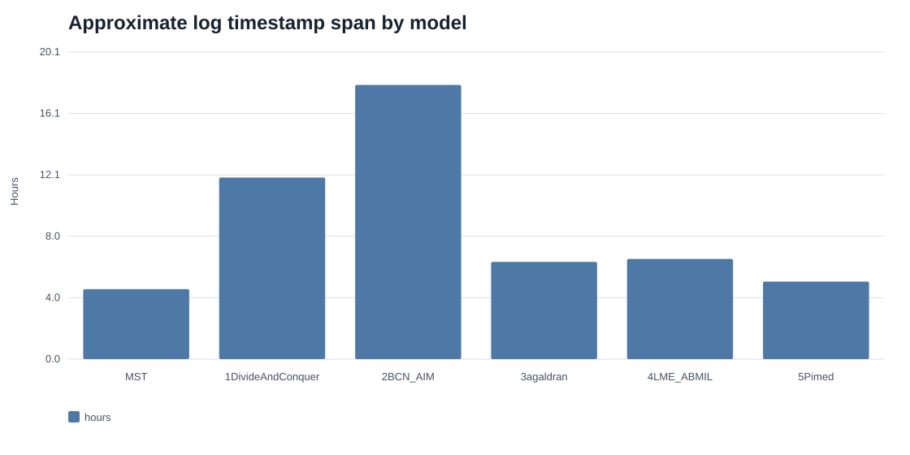

Durations are approximate spans between the first and last parseable timestamps in available logs. They are useful for relative runtime comparison, not billing-grade measurement.

## Failed and Ignored Runs

| Model | Job ID | Mapped run | Global models | Run dirs | Log span | Evidence |
| --- | --- | --- | --- | --- | --- | --- |
| 5Pimed | `8d59ef99-7eeb-4123-8d37-a1b9ebc08b56` | `5Pimed_unilateral_2026_05_15_034737` | 0/6 | 6/6 | 10m 16s | 2026-05-15 03:57:36,885 - PTClientAPILauncherExecutor - ERROR - [identity=CAM_1, run=8d59ef99-7eeb-4123-8d37-a1b9ebc08b56, peer=odelia_challenge_test_1.4.4-dev.260513.70574e1_model_test, peer_run=8d59ef99-7eeb-4123-8d37-a1b9ebc08b56, task_name=swarm_start, task_id=e947c9ba-064b-44a7-8e9c-4bdd9359fe6b] - External process has not called flare.init within timeout: 600 / 2026-05-15 03:57:36,888 - PTClientAPILauncherExecu |
| MST | `a9274d9a-b9b8-4904-b5a3-94ea7b96dcd3` | no run directory mapped | 0/6 | 0/6 | 8s | Traceback (most recent call last): / raise ConfigError(self.get_process_err_msg(e, elmt_str, location, node)) / nvflare.fuel.common.excepts.ConfigError: Error processing &#x27;/startupkit/startup/../a9274d9a-b9b8-4904-b5a3-94ea7b96dcd3/app_CAM_1/config/config_fed_client.conf&#x27; in element &#x27;id = &quot;persistor&quot; / }&#x27;: path: &#x27;components.#4&#x27;, exception: &#x27;ValueError: failed to instantiate class: RuntimeError: This example requires a |

- Ignored preflight: `00ec8d75-6c4a-4ccd-89c2-fc68dc9a91f7` (`preflight` / `swarm_preflight`).

## Validation Checks

- Every canonical UUID from the handoff was found under at least one site directory.
- Final job directories are checked against the expected six client sites: `CAM_1`, `MHA_1`, `RSH_1`, `RUMC_1`, `UKA_1`, `UMCU_1`.
- Run directories are matched by exact run name first, then by model prefix plus a five-minute timestamp tolerance to account for per-site timestamp drift.
- Checkpoints are only referenced by extracted path and size; they are not copied into the repo or `workspace/report_outputs`.
- `meta.json` status fields are treated as stale when contradicted by checkpoints, logs, or CSV artifacts.

## Reproduction

```bash
cd /home/jeff/Projects/MediSwarm

# Confirm archive and extraction.
ls -lh /mnt/nvme0n1p1/Jeff_projects/Odelia_local_training/challenge_training/20260513_ChallengeSwarmLocalTests.tar.gz
du -sh /mnt/nvme0n1p1/Jeff_projects/Odelia_local_training/challenge_training/20260513_ChallengeSwarmLocalTests

# Regenerate external validation tables before report generation, if needed.
python scripts/evaluation/run_challenge_swarm_local_external_eval.py \
  --root /mnt/nvme0n1p1/Jeff_projects/Odelia_local_training/challenge_training/20260513_ChallengeSwarmLocalTests

# Regenerate this report.
python scripts/evaluation/generate_challenge_swarm_local_report.py \
  --root /mnt/nvme0n1p1/Jeff_projects/Odelia_local_training/challenge_training/20260513_ChallengeSwarmLocalTests \
  --archive /mnt/nvme0n1p1/Jeff_projects/Odelia_local_training/challenge_training/20260513_ChallengeSwarmLocalTests.tar.gz
```


---

# Appended Source Context: ODELIA `Ole_swarm` Evaluation Artifact Report

# ODELIA `Ole_swarm` Evaluation Artifact Report

> Generated by `scripts/evaluation/generate_ole_swarm_report.py`. The main sections summarize the extracted Cosmos package; the final section keeps earlier `workspace/usz_partner_eval` material as supplemental context only.

## Executive Summary

- The archive has been extracted on `Cosmos` under `/mnt/nvme0n1p1/Jeff_projects/Odelia_local_training/Ole_swarm/20260424_DUKE_Experiment` and occupies about `2.6G` after extraction.
- The FL job completed 20 swarm rounds across `node_A`, `node_B`, and `node_C`; the `meta.json` status field is stale because it still reads `SUBMITTED`.
- `node_A` has two scratch runs. `MST_unilateral_2026_04_24_140845` is a one-epoch data-access preflight check; `MST_unilateral_2026_04_24_141333` is the actual run to use for model-quality interpretation.
- All extracted prediction CSVs contain only labels `0` and `2` although the model was configured with `num_classes: 3`. Class `1` AUROC is therefore undefined; AUROC values below average only the present classes `0` and `2`.
- The run has two serious caveats: all top-level node error logs report UID overlap across train/validation/test, and global-best selection failed because the aggregator looked for `accuracy` while the clients reported `val/ACC`.
- The included evaluation plot is present but mostly empty/redundant for the absent-class comparisons. The tables and summary charts below are the clearer source of evidence.

## Transfer and Extraction

| Field | Value |
| --- | --- |
| Remote host | `jeff@Cosmos` |
| Remote directory | `/mnt/nvme0n1p1/Jeff_projects/Odelia_local_training/Ole_swarm` |
| Archive | `20260424_DUKE_Experiment.tar.bz2` |
| Archive size | `2,431,153,159 bytes` (`2.3G` from `ls -lh`) |
| Extracted directory | `20260424_DUKE_Experiment/` (`2.6G`) |
| Modified | `2026-05-20 11:43:22 +0200` |
| SHA-256 | `2f4ee34c3403d3b1851f7a1739018f52ee799ea3f9eb54d521b2f09b9b5734a2` |

## Extracted Package Inventory

| Item | Value | Note |
| --- | --- | --- |
| Extracted directory | `20260424_DUKE_Experiment/` | `2.6G` after extraction |
| Archive size | `2,431,153,159 bytes` | `2.3G` from `ls -lh` |
| Top-level content | `admin@test.odelia`, `localhost`, `node_A`, `node_B`, `node_C`, `scratch` | full three-client swarm package |
| Job ID | `56580928-9848-41bd-b713-61c8818908a3` | same ID under all node job directories |
| Application | `ODELIA_ternary_classification` | from `meta.json` |
| Clients | `node_A`, `node_B`, `node_C` | from `meta.json` |
| Submitted | `2026-04-24T14:13:09.390659+00:00` | from `meta.json` |
| Global model files | `app_node_A/B/C/FL_global_model.pt` | `94,193,524` bytes each |
| Included plot | `evaluation.png` | `1492 x 2790`, copied to `docs/figures/ole_swarm/evaluation.png` |

## Runtime and Integrity Checks

| Check | Finding | Evidence |
| --- | --- | --- |
| Swarm completion | Completed | `round 19` finished on all nodes; logs state 20 rounds completed |
| Metadata status | Stale/incomplete | `meta.json` still says `SUBMITTED` even though logs show completion |
| Process return code | Not numeric | `_process_rc.txt` contains `None` on each node |
| Job-run error logs | Empty | `node_*/565.../log_error.txt` files are empty |
| Top-level node errors | Important | all three nodes report UID overlap across train/validation/test |
| Best-model selection | Broken | config looked for `accuracy`, but metrics used `val/ACC`; aggregator logged `No global best result!` |
| Final model behavior | Last result | node_A broadcast the last result, not a selected global-best result |
| Dataset statistics | Not included | `stats_pool_summary.json` files are NVFlare timing histograms, not data distribution reports |

## Run Inventory

The sample counts below are per validation epoch and come from the extracted prediction CSVs, not from a separate dataset-statistics file.

| Node | Run folder | Role | Epochs | Val samples/epoch | Val labels | Use |
| --- | --- | --- | --- | --- | --- | --- |
| node_A | `MST_unilateral_2026_04_24_140845` | preflight | 1 | 104 | `0:49`, `2:55` | exclude from model-quality interpretation |
| node_A | `MST_unilateral_2026_04_24_141333` | real run | 120 | 104 | `0:49`, `2:55` | site plus aggregated prediction CSVs |
| node_B | `MST_unilateral_2026_04_24_141346` | real run | 160 | 78 | `0:38`, `2:40` | site plus aggregated prediction CSVs |
| node_C | `MST_unilateral_2026_04_24_141332` | real run | 200 | 26 | `0:13`, `2:13` | site plus aggregated prediction CSVs |

## Extracted Validation Results

Metrics were recomputed from `*_gt_and_classprob_validation.csv`. `Best AUROC` is the average of one-vs-rest AUROC for classes `0` and `2`; class `1` is absent and is not included.

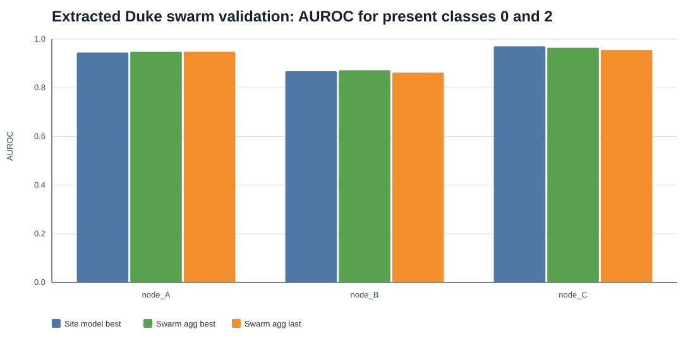

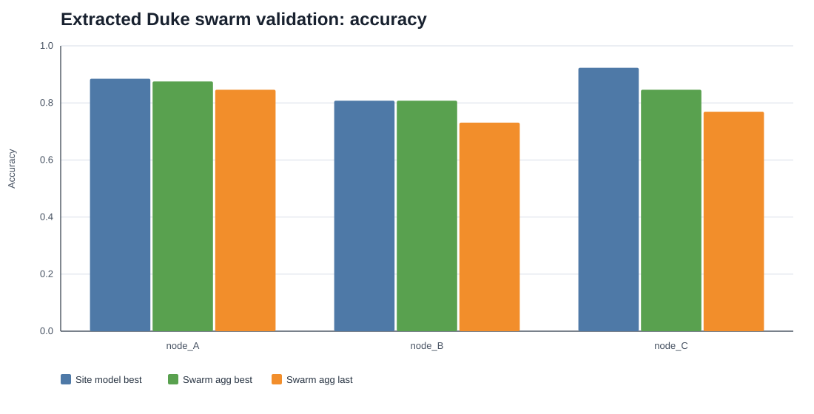

| Node | Stream | Samples | Epochs | Best AUROC | Best ACC epoch/value | Last AUROC/ACC |
| --- | --- | --- | --- | --- | --- | --- |
| node_A | preflight site | 104 | 0 | 0.561 | 0 / 0.519 | 0.561 / 0.519 |
| node_A | real site | 104 | 0-119 | 0.945 @ 66 | 50 / 0.885 | 0.918 / 0.808 |
| node_A | swarm aggregated | 104 | 20 rounds | 0.948 @ 114 | 54 / 0.875 | 0.948 / 0.846 |
| node_B | real site | 78 | 0-159 | 0.868 @ 113 | 96 / 0.808 | 0.823 / 0.654 |
| node_B | swarm aggregated | 78 | 20 rounds | 0.872 @ 112 | 88 / 0.808 | 0.862 / 0.731 |
| node_C | real site | 26 | 0-199 | 0.970 @ 159 | 159 / 0.923 | 0.953 / 0.846 |
| node_C | swarm aggregated | 26 | 20 rounds | 0.965 @ 180 | 160 / 0.846 | 0.956 / 0.769 |

### Training CSV Check

Training CSVs are useful as a sanity check only. They should not override the validation caveats above.

| Stream | Samples/epoch | Epochs | Best AUROC | Best ACC epoch/value | Last AUROC/ACC |
| --- | --- | --- | --- | --- | --- |
| node_A real site train | 416 | 0-119 | 0.949 @ 115 | 83 / 0.894 | 0.947 / 0.875 |
| node_B real site train | 312 | 0-159 | 0.943 @ 159 | 126 / 0.865 | 0.943 / 0.782 |
| node_C real site train | 104 | 0-199 | 0.969 @ 199 | 159 / 0.913 | 0.969 / 0.885 |

## Included Evaluation Plot

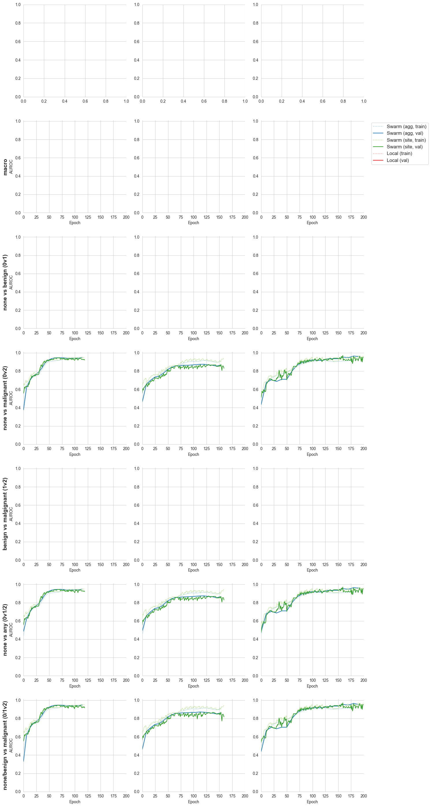

The plot confirms the class-coverage issue visually. Rows for `macro`, `none vs benign (0v1)`, and `benign vs malignant (1v2)` are empty because class `1` is not represented. The rows involving class `2` carry the real signal and appear repeated across equivalent binary views when only classes `0` and `2` exist.

## Interpretation

- This is a completed three-client swarm run, but it should be described as a last-model artifact rather than a valid selected-global-best artifact.
- The strongest extracted validation AUROC is on `node_C`, but that node has only 26 validation samples per epoch; `node_A` has more stable support with 104 validation samples and a final aggregated AUROC of `0.948`.
- `node_B` is the weakest validation site by both AUROC and final aggregated accuracy, so site-level variability is material.
- Do not present class-1 performance or three-class macro AUROC from this package. The extracted labels only support binary class-0/class-2 interpretation.
- The UID-overlap errors are the main blocker for treating the metrics as final evidence. They need split auditing before the numbers are used externally.

## Supplemental Workspace Context

Everything below comes from `workspace/usz_partner_eval`, not from the extracted `Ole_swarm` transfer package. Keep it as internal validation context only.

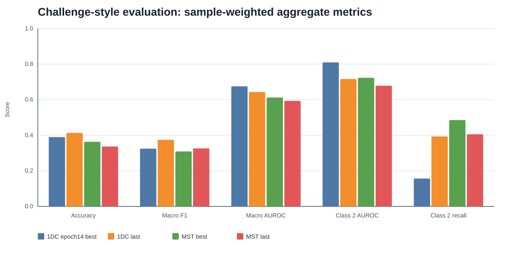

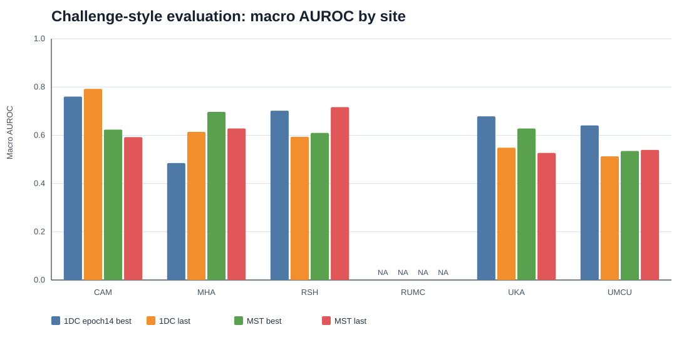

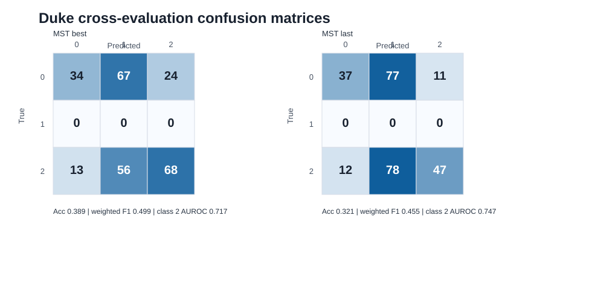

### Challenge-Style External Site Evaluation

The table below is sample-weighted over sites. `macro_auroc` excludes a site only when that site has no valid value for that metric.

| Run | Samples | Accuracy | Macro F1 | Weighted F1 | Macro AUROC | Class 2 AUROC | Class 2 F1 | Class 2 Recall |
| --- | --- | --- | --- | --- | --- | --- | --- | --- |
| 1DC_epoch14_best | 300 | 0.390 | 0.325 | 0.427 | 0.675 | 0.810 | 0.204 | 0.157 |
| 1DC_last | 300 | 0.413 | 0.375 | 0.442 | 0.643 | 0.716 | 0.375 | 0.393 |
| MST_best | 300 | 0.363 | 0.309 | 0.376 | 0.612 | 0.723 | 0.332 | 0.486 |
| MST_last | 300 | 0.337 | 0.326 | 0.350 | 0.594 | 0.679 | 0.405 | 0.406 |

### Challenge Site Spread

| Run | Best site | Best macro AUROC | Lowest site | Lowest macro AUROC |
| --- | --- | --- | --- | --- |
| 1DC_epoch14_best | CAM | 0.760 | MHA | 0.485 |
| 1DC_last | CAM | 0.792 | UMCU | 0.513 |
| MST_best | MHA | 0.697 | UMCU | 0.535 |
| MST_last | RSH | 0.717 | UKA | 0.527 |

### Supplemental Duke Cross-Evaluation

These supplemental results use the USZ-trained MST checkpoints on the Duke binary test split. True class `1` is absent in this Duke slice, so class-1 recall/F1 are not clinically interpretable and macro AUROC is unavailable.

| Checkpoint | Kind | Samples | Accuracy | Weighted F1 | Macro F1 | Class 0 AUROC | Class 2 AUROC |
| --- | --- | --- | --- | --- | --- | --- | --- |
| USZ_MST_best | best | 262 | 0.389 | 0.499 | 0.330 | 0.681 | 0.717 |
| USZ_MST_last | single | 262 | 0.321 | 0.455 | 0.302 | 0.672 | 0.747 |

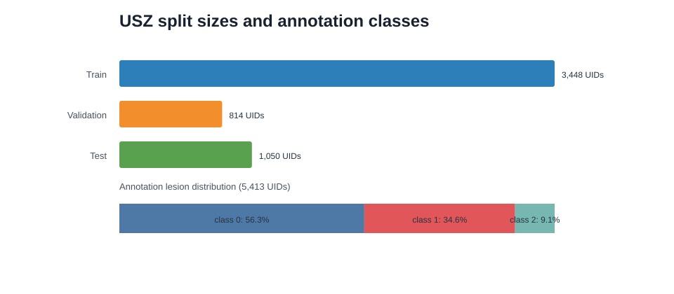

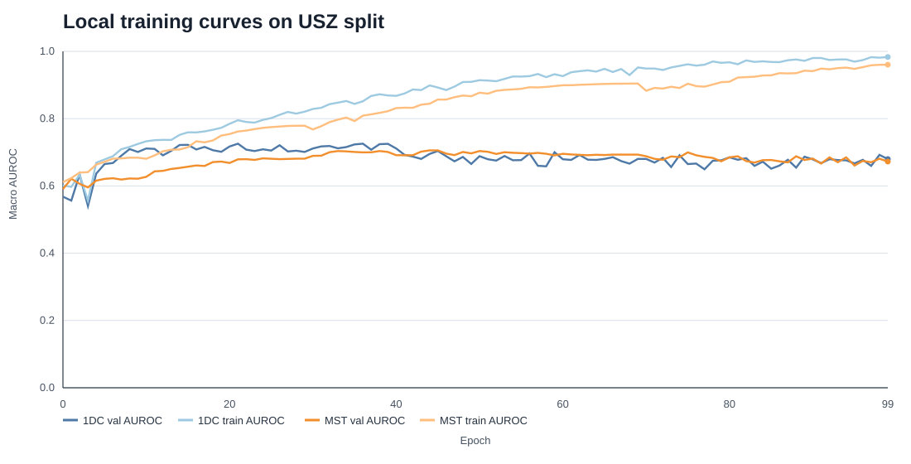

### Supplemental Data Checks

| Check | Value | Interpretation |
| --- | --- | --- |
| Split UIDs | 5,312 | train + val + test |
| Split UIDs with image | 5,312 | matches split UIDs |
| Split UIDs missing image | 0 | expected 0 |
| Image dirs outside split | 6,346 | 11,658 dirs total - 5,312 split dirs |
| Annotation UIDs not in split | 101 | not evaluated in these artifacts |

### Supplemental Split Sizes

| Split | UIDs | Share |
| --- | --- | --- |
| Train | 3,448 | 64.9% |
| Validation | 814 | 15.3% |
| Test | 1,050 | 19.8% |

### Supplemental Annotation Labels

| Label | UIDs | Share |
| --- | --- | --- |
| Class 0 | 3,046 | 56.3% |
| Class 1 | 1,875 | 34.6% |
| Class 2 | 492 | 9.1% |

### Supplemental Prediction-History Analysis

The table recomputes metrics from per-epoch prediction CSVs already present in the workspace. It is not evidence that local training was run as part of the `Ole_swarm` package transfer.

| Model | Saved Best Ckpt | Peak Val AUROC Epoch | Peak Val AUROC | Peak Val Acc | Peak Val Macro F1 | Last Val AUROC | Last Val Acc | Last Train AUROC | Best Ckpt Size |
| --- | --- | --- | --- | --- | --- | --- | --- | --- | --- |
| 1DivideAndConquer | epoch 14 | 36 | 0.726 | 0.608 | 0.518 | 0.680 | 0.588 | 0.983 | 1033.3 MB |
| MST | epoch 33 | 45 | 0.706 | 0.593 | 0.484 | 0.672 | 0.557 | 0.960 | 269.5 MB |

### Supplemental Local Run Logs

| Run | Log | Exit | Best checkpoint | Last checkpoint |
| --- | --- | --- | --- | --- |
| 1DC retry | `workspace/usz_partner_eval/logs/local_1DC_retry.log` | 0 | `/scratch/runs/USZ_1/1DivideAndConquer_unilateral_2026_05_09_185500/epoch=14-step=6465.ckpt` | `/scratch/runs/USZ_1/1DivideAndConquer_unilateral_2026_05_09_185500/last_global_model.ckpt` |
| MST | `workspace/usz_partner_eval/logs/local_MST.log` | 0 | `/scratch/runs/USZ_1/MST_unilateral_2026_04_28_083041/epoch=33-step=14654.ckpt` | `/scratch/runs/USZ_1/MST_unilateral_2026_04_28_083041/last_global_model.ckpt` |
| 1DC first attempt | `workspace/usz_partner_eval/logs/local_1DC.log` | 139 | NA | NA |

## Transfer Note

The extracted artifact is on the server at:

`jeff@Cosmos:/mnt/nvme0n1p1/Jeff_projects/Odelia_local_training/Ole_swarm/20260424_DUKE_Experiment`

Useful archive commands on the server:

```bash
cd /mnt/nvme0n1p1/Jeff_projects/Odelia_local_training/Ole_swarm

# Confirm the received archive.
ls -lh 20260424_DUKE_Experiment.tar.bz2
sha256sum 20260424_DUKE_Experiment.tar.bz2

# Inspect the archive without extracting it.
tar -tjf 20260424_DUKE_Experiment.tar.bz2 | sed -n '1,120p'

# The current extracted directory should already be present.
du -sh 20260424_DUKE_Experiment
```
